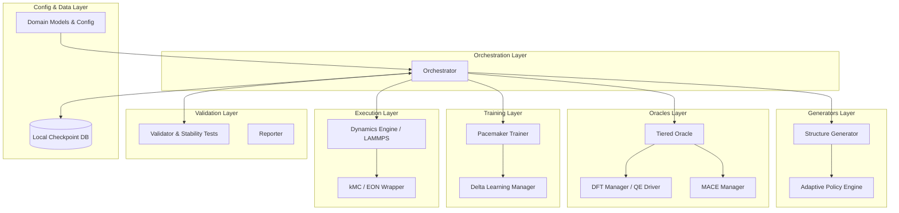

# PYACEMAKER: NextGen Hierarchical Distillation Architecture


## 1. Project Title & Description

PYACEMAKER is an advanced, fully automated Machine Learning Interatomic Potential (MLIP) construction and operational pipeline.

Designed for high-performance computational materials science, PYACEMAKER solves the "Time-Continuity Break" and "Data Inefficiency" problems inherent in traditional Active Learning loops. By tightly integrating the robust Pacemaker ACE formalism with the immense generalisation power of Foundation Models (MACE), this system provides a zero-configuration, self-healing workflow. It allows researchers to seamlessly run multi-million atom molecular dynamics (MD) or kinetic Monte Carlo (kMC) simulations, automatically handling high-uncertainty events, intelligently extracting and passivating local defect clusters, refining the models on-the-fly with Density Functional Theory (DFT), and resuming simulations without ever dropping physical state.

## 2. Key Features

1. **Zero-Shot Foundation Model Distillation:** Drastically reduce expensive DFT calculations by using MACE-MP-0 as a high-fidelity surrogate oracle. Confident predictions are immediately distilled into the fast ACE potential, reserving DFT strictly for profound physical unknowns.
2. **Intelligent Tiered Oracle Routing:** The system uses a dynamic `TieredOracle` that evaluates generated structures against the `MACEManager` first. Only structures where the foundation model's epistemic uncertainty exceeds a configurable safety threshold are routed to the heavy `DFTManager` for first-principles evaluation. This ensures both computational efficiency and physical correctness.
3. **Master-Slave MD Resume (Time-Continuity):** Completely stateful and continuous Molecular Dynamics pipeline. Simulations that pause upon encountering high-uncertainty configurations cleanly checkpoint their exact phase-space geometry (via `.restart` binaries). After active learning and potential retraining, the engine seamlessly thermalizes the system with a soft-start `langevin` protocol, completely solving the "Time-Continuity Break" limitation and enabling true nanosecond-scale continuous multi-phase discovery.
4. **Physics-Informed Cutoff Constraints:** Configure precise, mathematically validated extraction boundaries. Strict validation guarantees that extraction regions possess a valid physical buffer zone, preventing unphysical structural representations.
5. **Tiered Uncertainty Evaluations:** Implement sophisticated two-tier uncertainty evaluations based on the FLARE architecture. Differentiate between global thresholds for halting simulations and local thresholds for atom selection, preventing infinite loops and ensuring high-quality training sets.
6. **Intelligent Cluster Extraction & Auto-Passivation:** When MD encounters unknown territory (e.g., complex interfaces or high-energy collisions), the system intelligently extracts the exact spherical region of failure. It automatically passivates dangling surface bonds and pre-relaxes the buffer zone, ensuring the cluster sent to DFT is electrically neutral and physically stable, preventing catastrophic SCF divergence.
7. **Hierarchical Finetuning & Incremental Updating:** Stop retraining from scratch. The system finetunes the foundation model on the sparse new DFT data, generates thousands of surrogate training points, and performs a rapid, computationally cheap "Delta Learning" update on the ACE potential while mixing in a Replay Buffer to prevent catastrophic forgetting.

## 3. Architecture Overview

PYACEMAKER is built upon a highly modular, Pydantic-validated architecture enforcing strict separation of concerns. The central Orchestrator manages a 4-phase loop:
1. **Zero-Shot Distillation:** Building the baseline model via MACE surrogate evaluation.
2. **Validation:** Rigorous physical testing (Phonon dispersion, Elastic tensors).
3. **Exploration & Cutout:** Running continuous MD, governed by two-tier uncertainty thresholds.
4. **Finetuning:** Updating MACE and incrementally updating ACE with Replay Buffers.



## 4. Prerequisites

To run PYACEMAKER, ensure your system meets the following requirements:
- Python 3.12+
- `uv` package manager (recommended for fast, deterministic dependency resolution)
- Valid installations of underlying scientific binaries:
  - LAMMPS (compiled with USER-PACE)
  - Quantum Espresso (or VASP, if configured)
  - Pacemaker
- Appropriate hardware (GPUs strongly recommended for MACE PyTorch inference and DFT execution).

## 5. Installation & Setup

We recommend using `uv` to manage the project's virtual environment and dependencies.

```bash
# Clone the repository
git clone https://github.com/your-org/mlip-pipelines.git
cd mlip-pipelines

# Sync dependencies using uv
uv sync

# Set up environment variables
cp .env.example .env
```

## 6. Usage

PYACEMAKER is designed to be completely driven by its robust configuration schema.

### Quick Start Example

You can define your run parameters in a YAML configuration file or construct the Pydantic models directly in Python.

```python
from pathlib import Path
from pyacemaker.core.orchestrator import Orchestrator
from pyacemaker.domain_models.config import ProjectConfig

# Load your configuration (either via dict or YAML)
config = ProjectConfig.model_validate_json(Path("config.json").read_text())

# Initialize the NextGen Orchestrator
orchestrator = Orchestrator(config)

# Start the Active Learning Distillation Loop
orchestrator.run_cycle()
```

For a comprehensive interactive walkthrough, please run our official Marimo tutorial:
```bash
uv run python tutorials/FePt_MgO_interface_energy.py
```

## 7. Development Workflow

This project enforces strict code quality standards to ensure the complex physical logic remains maintainable and safe.

- **Type Checking:** We use `mypy` in strict mode. Run it via:
  ```bash
  uv run mypy .
  ```
- **Linting & Formatting:** We use `ruff` to enforce PEP 8 and modern Python idioms. Run it via:
  ```bash
  uv run ruff check .
  uv run ruff format .
  ```
- **Testing:** We use `pytest` with extensive mocking to verify orchestrator logic without requiring multi-hour HPC jobs. Run the suite via:
  ```bash
  uv run pytest
  ```

## 8. Project Structure

```text
mlip-pipelines/
├── src/
│   ├── core/              # Orchestrator and SQLite State Checkpointing
│   ├── domain_models/     # Pydantic Schemas (Config, DTOs)
│   ├── dynamics/          # LAMMPS/EON Engines & Master-Slave Resume Logic
│   ├── generators/        # Structure Generation & Intelligent Cutout/Passivation
│   ├── oracles/           # Tiered Oracle, MACE Manager, DFT Manager
│   ├── trainers/          # Pacemaker ACE Trainer & MACE Finetune Manager
│   └── validators/        # Physical Stability Testing (Phonons, EOS)
├── tests/                 # Comprehensive Unit and Integration Tests
├── tutorials/             # Executable Marimo Notebooks
├── dev_documents/         # System Architecture & Development Specs
├── pyproject.toml         # Dependency & Linter Definitions
└── README.md              # Project Landing Page
```

## 9. License

This project is licensed under the MIT License.


## High-Performance State Resumption
The Orchestrator features a highly robust, database-backed state machine. If a multi-day job is abruptly killed by a Slurm scheduler's wall-time limit, the system can instantly and safely resume from the exact micro-operation. Furthermore, it features an aggressive, asynchronous cleanup daemon to prevent HPC quota limits.