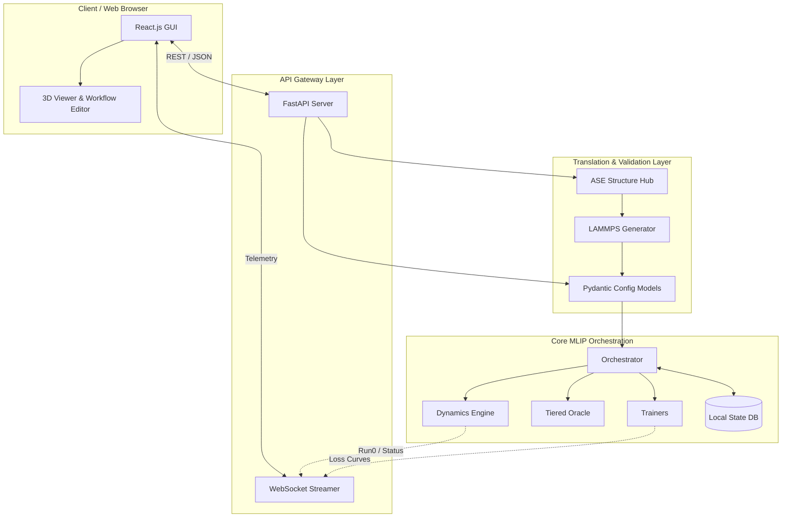

# PYACEMAKER: NextGen Hierarchical Distillation Architecture


## 1. Project Title & Description

PYACEMAKER (Adaptive-MLIP) is an advanced, fully automated Machine Learning Interatomic Potential (MLIP) construction and operational pipeline, now powered by a next-generation **Intent-Driven GUI Platform**.

Designed for high-performance computational materials science, PYACEMAKER solves the "Time-Continuity Break" and "Data Inefficiency" problems inherent in traditional Active Learning loops. By tightly integrating the robust Pacemaker ACE formalism with the immense generalisation power of Foundation Models (MACE), this system provides a zero-configuration, self-healing workflow.

With the introduction of the GUI, researchers can now seamlessly run multi-million atom molecular dynamics (MD) or kinetic Monte Carlo (kMC) simulations by simply specifying their high-level intent (e.g., target material, accuracy vs. speed trade-off). The system's intelligent compiler automatically handles high-uncertainty events, extracts local defect clusters, refines models on-the-fly with Density Functional Theory (DFT), translates visual selections into complex LAMMPS scripts, and resumes simulations without ever dropping physical state.

The system now additionally features a robust REST API gateway designed to securely bridge the high-performance Python backend with intent-driven frontend Graphical User Interfaces.

## 2. Key Features

1. **Intent-Driven UI & Smart Trade-offs:** Eliminate complex text configurations. Users simply set an "Accuracy vs. Speed" slider, and the backend automatically mathematically provisions the optimal hyperparameter thresholds, buffer radii, and sampling intervals.
2. **Intent-Driven GUI Translation**: End users no longer need to wrestle with complex hyperparameter arrays. The built-in REST API intercepts a single, simplified 1-to-10 "Speed vs Accuracy" tradeoff slider and seamlessly translates it into perfectly optimized mathematical boundaries, shielding the backend engines from misconfigurations.
3. **Visual & Semantic State Management:** Define complex simulation boundaries (e.g., freezing a slab layer) directly in a 3D viewer. The system seamlessly translates these visual tags into error-free LAMMPS `region` and `group` commands.
3. **Zero-Shot Foundation Model Distillation:** Drastically reduce expensive DFT calculations by using MACE-MP-0 as a high-fidelity surrogate oracle. Confident predictions are distilled into the fast ACE potential, reserving DFT strictly for profound physical unknowns.
4. **Master-Slave MD Resume (Time-Continuity):** Completely stateful and continuous Molecular Dynamics pipeline. Simulations that pause upon encountering high-uncertainty cleanly checkpoint their exact phase-space geometry.
5. **Real-time Telemetry & Run 0 Diagnostics:** Catch physical crashes (e.g., atomic collisions) instantly with pre-flight "Run 0" validations before submitting HPC jobs. Monitor live training loss curves and MD energy maps via high-speed WebSockets.
6. **Intelligent Cluster Extraction & Auto-Passivation:** When MD encounters unknown territory, the system intelligently extracts the exact spherical region of failure, passivating dangling surface bonds to ensure electrical neutrality before DFT evaluation.
7. **Auto-HPO & Hierarchical Finetuning:** Automatically optimize foundation model hyperparameters (learning rate, energy weights) in the background based on user policy (Generalize vs. Specialize) to prevent catastrophic forgetting.

## 3. Architecture Overview

PYACEMAKER is built upon a highly modular, Pydantic-validated architecture enforcing strict separation of concerns. The GUI acts as an intelligent compiler, communicating via FastAPI to a central Orchestrator that manages a 4-phase loop: Zero-Shot Distillation, Validation, Exploration & Cutout, and Finetuning.



## 4. Prerequisites

To run PYACEMAKER, ensure your system meets the following requirements:
- Python 3.12+
- `uv` package manager (recommended for fast, deterministic dependency resolution)
- Valid installations of underlying scientific binaries:
  - LAMMPS (compiled with USER-PACE)
  - Quantum Espresso (or VASP, if configured)
  - Pacemaker
- Appropriate hardware (GPUs strongly recommended for MACE PyTorch inference and DFT execution).

## 5. Installation & Setup

We recommend using `uv` to manage the project's virtual environment and dependencies.

```bash
# Clone the repository
git clone https://github.com/your-org/mlip-pipelines.git
cd mlip-pipelines

# Sync dependencies using uv
uv sync

# Set up environment variables
cp .env.example .env
```

## 6. Usage

PYACEMAKER is designed to be driven either by its robust configuration schema or the new FastAPI backend.

### Quick Start Example

Start the FastAPI backend server to allow GUI connections:

```bash
uv run uvicorn src.api.main:app --host 0.0.0.0 --port 8000
```

Alternatively, you can run the core orchestrator programmatically:

```python
from pathlib import Path
from src.core.orchestrator import Orchestrator
from src.domain_models.config import ProjectConfig

# Load your configuration
config = ProjectConfig.model_validate_json(Path("config.json").read_text())

# Initialize and run the NextGen Orchestrator
orchestrator = Orchestrator(config)
orchestrator.run_cycle()
```

For a comprehensive interactive walkthrough of the GUI API workflows, please run our official Marimo tutorial:
```bash
uv run python tutorials/adaptive_mlip_gui_workflow.py
```

## 7. Development Workflow

This project enforces strict code quality standards to ensure the complex physical logic remains maintainable and safe.

- **Type Checking:** We use `mypy` in strict mode. Run it via:
  ```bash
  uv run mypy .
  ```
- **Linting & Formatting:** We use `ruff` to enforce PEP 8 and modern Python idioms. Run it via:
  ```bash
  uv run ruff check .
  uv run ruff format .
  ```
- **Testing:** We use `pytest` with extensive mocking to verify API translation and orchestrator logic without requiring multi-hour HPC jobs. Run the suite via:
  ```bash
  uv run pytest
  ```

## 8. Project Structure

```text
mlip-pipelines/
├── src/
│   ├── api/               # FastAPI endpoints, WebSocket telemetry, Async Tasks
│   ├── core/              # Orchestrator and SQLite State Checkpointing
│   ├── domain_models/     # Pydantic Schemas (ProjectConfig, GUI State DTOs)
│   ├── dynamics/          # LAMMPS/EON Engines & Semantic Region Translators
│   ├── generators/        # Structure Generation & Intelligent Cutout/Passivation
│   ├── oracles/           # Tiered Oracle, MACE Manager, DFT Manager
│   ├── trainers/          # Pacemaker ACE Trainer & Auto-HPO Manager
│   └── validators/        # Physical Stability Testing (Phonons, EOS)
├── tests/                 # Comprehensive Unit and Integration Tests
├── tutorials/             # Executable Marimo Notebooks (UAT)
├── dev_documents/         # System Architecture & Development Specs
├── pyproject.toml         # Dependency & Linter Definitions
└── README.md              # Project Landing Page
```

## 9. License

This project is licensed under the MIT License.

## High-Performance State Resumption
The Orchestrator features a highly robust, database-backed state machine. If a multi-day job is abruptly killed by a Slurm scheduler's wall-time limit, the system can instantly and safely resume from the exact micro-operation via the `/orchestrator/resume` endpoint. Furthermore, it features an aggressive, asynchronous cleanup daemon to prevent HPC quota limits.
