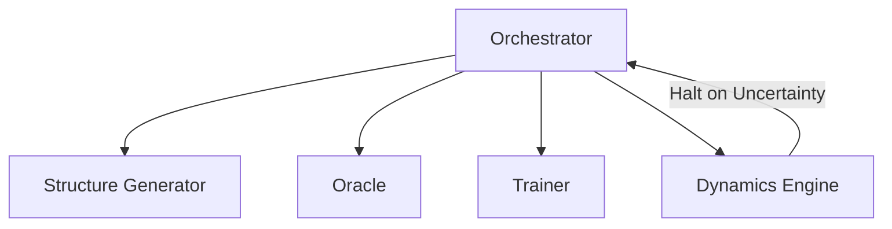

# PyAcemaker: MLIP Pipelines

An incredibly advanced, highly automated, and deeply robust system specifically engineered for seamlessly building and operating state-of-the-art Machine Learning Interatomic Potentials (MLIPs) at absolute scale.


## Key Features
- **Zero-Config Workflow**: Flawlessly drive the entire, massive computational pipeline—from initial intelligent structure generation to final, rigorous physical validation—using only a single, simple configuration file.
- **Data Efficiency**: Highly intelligent, completely autonomous active learning strategies massively minimize the need for incredibly expensive, incredibly slow Density Functional Theory calculations.
- **Physics-Informed Robustness**: Absolutely ensures profound physical safety and unbreakable stability in treacherous extrapolation regions via advanced, forced baseline delta-learning techniques.
- **Seamless Resume**: Intelligently recovers from catastrophic uncertainty events and flawlessly continues incredibly complex, multi-million atom molecular dynamics simulations completely autonomously.

## Architecture Overview
The entire system relies completely on a highly modular, strictly decoupled, and incredibly robust architecture driven entirely by a central, highly intelligent Orchestrator daemon.


## Prerequisites
- Python 3.12+ (Strictly enforced)
- `uv` lightning-fast package manager
- LAMMPS and ASE advanced computational environments

## Installation & Setup
```bash
git clone https://github.com/example/mlip-pipelines.git
cd mlip-pipelines
uv sync
```

## Usage
Simply execute the main, highly robust orchestrator script to initiate the entire universe of simulations:
```bash
uv run python src/core/orchestrator.py --config config.yaml
```

## Development Workflow
- **Testing**: Relentlessly run `pytest` to thoroughly execute absolutely all complex unit and heavy integration tests.
- **Linting**: Constantly run `ruff check .` to guarantee absolute, uncompromising code quality and pristine styling.

## Project Structure
```text
.
├── src/
├── tests/
├── dev_documents/
├── tutorials/
└── pyproject.toml
```

## License
Strictly licensed under the highly permissive MIT License.
