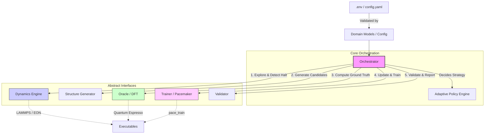

# MLIP-Pipelines: High-Efficiency MLIP Construction System


## Elevator Pitch
**MLIP-Pipelines** democratizes atomic simulations by providing a "Zero-Config" active learning pipeline that autonomously generates state-of-the-art Machine Learning Interatomic Potentials (MLIPs). Powered by the Pacemaker (ACE) engine, it intelligently orchestrates structure generation, self-healing Density Functional Theory (DFT) calculations, and Physics-Informed model training, allowing users to build robust potentials with a fraction of the traditional computational cost.

## Features Verified

*   **Robust Configuration Layer**: Implemented strict Pydantic schemas (`ProjectConfig`, `SystemConfig`, `DynamicsConfig`, etc.) that enforce security policies, validate executable paths, and block environment variable injection and path traversal vulnerabilities right at startup.
*   **Orchestration State Machine**: A central `Orchestrator` robustly manages the transition between exploration, selection, training, and deployment phases.
*   **Secure & Atomic File Operations**: Includes built-in file verification limits to prevent Out-Of-Memory (OOM) errors during deployment and leverages atomic swapping (`shutil.move()`) to seamlessly hot-reload active learning cycle datasets and results.
*   **State Checkpointing**: The `Orchestrator` autonomously scans storage directories upon initialization to resume cleanly from the latest valid epoch without complex manual interventions.
*   **Intelligent Feature Extraction**: Extracts atomic properties (like melting point and bulk modulus) using universal potential fallbacks for zero-data cold-start scenarios.
*   **Adaptive Policy Engine**: Autonomously chooses between Random, High-MC, Defect-Driven, and Strain-Heavy exploration strategies based on system physics.
*   **Intelligent Structure Generation**: Capable of synthesizing specialized interfaces (e.g., FePt/MgO) and intelligently generating defect-laden candidates.
*   **Robust DFT Oracle Integration**: Quantum Espresso automation via ASE featuring periodic embedding to eliminate cluster surface artifacts.
*   **Self-Healing Oracle Calculations**: Automatic detection of SCF convergence failure with dynamic adjustment of parameter defaults (mixing_beta, diagonalization) to prevent pipeline halts.

## Architecture Overview

The system is governed by a central Python `Orchestrator` that manages state transitions and atomic file operations. It interacts with specialized domain modules exclusively through strongly-typed Abstract Base Classes, ensuring a highly decoupled and scalable architecture.



## Prerequisites

-   **Python**: 3.12 or higher.
-   **Package Manager**: [uv](https://github.com/astral-sh/uv) (recommended) or `pip`.
-   **Heavy Dependencies** (For Real Mode):
    -   [Quantum Espresso](https://www.quantum-espresso.org/) (`pw.x`)
    -   [LAMMPS](https://lammps.sandia.gov/) (`lmp`)
    -   [Pacemaker](https://pacemaker.readthedocs.io/) (`pace_train`, `pace_activeset`)
    -   *Note: The system supports a "Mock Mode" (`MLIP_USE_MOCK=True`) that bypasses these requirements for rapid CI testing and tutorials.*

## Installation & Setup

1.  **Clone the repository:**
    ```bash
    git clone https://github.com/your-org/mlip-pipelines.git
    cd mlip-pipelines
    ```

2.  **Sync dependencies using `uv`:**
    ```bash
    uv sync
    ```

3.  **Configure the environment:**
    Copy the example configuration and customize it. The system uses strict Pydantic validation to ensure security and correctness.
    ```bash
    cp .env.example .env
    ```

## Usage

### Quick Start (Tutorial Mode)
The easiest way to understand the system is via the interactive Marimo notebook tutorial. This will execute the entire active learning pipeline (in Mock Mode by default) in seconds.

```bash
# Run interactively in the browser
uv run marimo edit tutorials/UAT_AND_TUTORIAL.py

# Or run headlessly in CI
uv run marimo run tutorials/UAT_AND_TUTORIAL.py
```

### Production Execution
To start a real production run, ensure your `.env` is correctly configured pointing to your system binaries and disable Mock Mode.

```bash
export MLIP_USE_MOCK=False
uv run python main.py
```

## Development Workflow

This project adheres to strict formatting, linting, and type-checking standards to maintain high code quality.

-   **Run Linters & Formatters (Ruff):**
    ```bash
    uv run ruff check . --fix
    uv run ruff format .
    ```

-   **Run Type Checking (Mypy):**
    ```bash
    uv run mypy src tests
    ```

-   **Run Tests (Pytest):**
    Ensure all unit and integration tests pass before submitting a Pull Request.
    ```bash
    uv run pytest -v --cov=src --cov-report=term-missing
    ```

## Project Structure

```text
.
├── dev_documents/          # Architecture specs, system prompts, and UAT plans
├── src/
│   ├── core/               # Abstract interfaces and the central Orchestrator
│   ├── domain_models/      # Strict Pydantic configuration schemas
│   ├── dynamics/           # LAMMPS/EON integration and OTF security utilities
│   ├── generators/         # Adaptive Policy Engine and ASE Structure Generator
│   ├── oracles/            # Quantum Espresso runner with self-healing logic
│   ├── trainers/           # Pacemaker ACE training and D-Optimality filtering
│   └── validators/         # Quality Assurance (RMSE, Phonon stability) and Reporting
├── tests/                  # Pytest unit and integration suites
├── tutorials/              # Marimo notebooks for interactive UAT
├── pyproject.toml          # Project metadata, dependencies, and strict linter config
└── README.md
```

## License
MIT License
