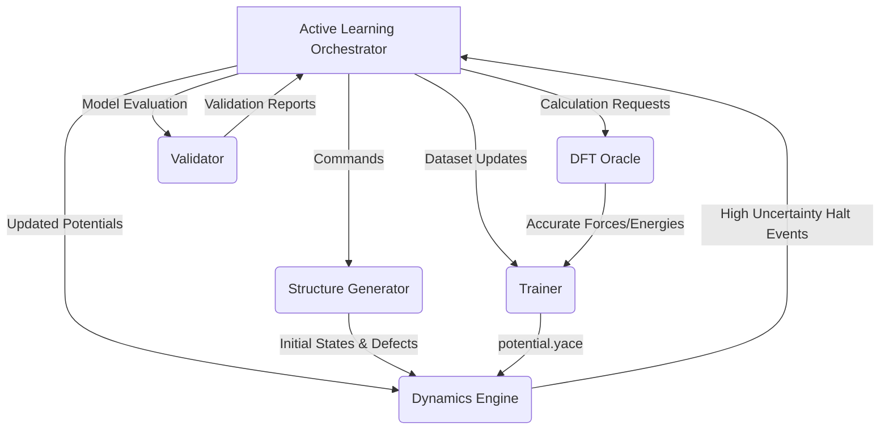

# mlip-pipelines

  

## Project Title & Description
**mlip-pipelines: Zero-Config Automated MLIP Builder**

`mlip-pipelines` is an automated, zero-configuration system designed to build and deploy State-of-the-Art Machine Learning Interatomic Potentials (MLIPs) using the Pacemaker (ACE) engine. It bridges the gap between complex data science and computational materials physics by completely automating structural exploration, Density Functional Theory (DFT) calculations, model training, and dynamic simulation validation into a single, seamless pipeline.

## Key Features
- **Zero-Config Workflow:** Just provide a single YAML file. The system autonomously handles initial structure generation, active learning iterations, and model deployment without requiring manual Python scripts.
- **Data Efficiency via Active Learning:** Employs an Adaptive Exploration Policy combined with D-Optimality active set selection to achieve high precision (RMSE Energy < 1 meV/atom) with less than 1/10th the typical DFT cost.
- **Physics-Informed Robustness:** Integrates a physical baseline (Lennard-Jones/ZBL) for Delta Learning, ensuring strict core-repulsion physics to prevent atomic overlap and segmentation faults in unseen environments.
- **On-The-Fly (OTF) Self-Healing:** Monitors extrapolation grades ($\gamma$) during Molecular Dynamics (MD) or kinetic Monte Carlo (kMC) runs, automatically halting, generating local embedded clusters for DFT, and fine-tuning the potential before resuming.

## Architecture Overview
The system revolves around the central **Active Learning Orchestrator**, coordinating four stateless modules via strict dependency injection. The **Structure Generator** proposes unseen states; the **DFT Oracle** computes ground truth forces with self-healing SCF routines and periodic embedding; the **Trainer** fits the ACE potential; and the **Dynamics Engine** runs LAMMPS/EON simulations while monitoring uncertainties.



## Prerequisites
- Python >= 3.12
- `uv` (Fast Python package and environment manager)
- (Optional) Quantum ESPRESSO (`pw.x`) and LAMMPS configured in PATH for Real Mode.

## Installation & Setup
Initialize the project using `uv` to ensure strict dependency resolution:

```bash
git clone <repository_url> mlip-pipelines
cd mlip-pipelines
uv sync
```

*(Note: In CI or Mock Mode, external physical solvers like LAMMPS or Quantum Espresso are mocked by default.)*

## Usage
The primary interaction is through the CLI orchestrator, pointing to your setup file.

**Quick Start:**
```bash
uv run src/main.py --config config.yaml
```

To run the interactive tutorials (e.g., computing the FePt/MgO interface energy):
```bash
uv run marimo edit tutorials/UAT_AND_TUTORIAL.py
```

## Development Workflow
The system is built sequentially across 8 distinct architecture cycles.
Code quality is strictly enforced via `ruff` and `mypy`.

- **Run Linters & Type Checking:**
  ```bash
  uv run ruff check .
  uv run mypy .
  ```
- **Run Tests:**
  ```bash
  uv run pytest
  ```
  Tests are designed to run without side-effects, employing temporary directories and extensive `unittest.mock` configurations to spoof high-cost physical calculations.

## Project Structure
```ascii
project_root/
├── src/
│   ├── core/              # Orchestration & Pydantic Configs
│   ├── generators/        # Adaptive Structure Policies
│   ├── oracles/           # DFT Integration (QE) & Embedding
│   ├── trainers/          # Pacemaker & Active Set Logic
│   ├── dynamics/          # LAMMPS / EON kMC wrappers
│   └── validators/        # QA gating (Phonon, Elasticity)
├── tests/                 # Isolated test suites
├── dev_documents/         # System designs and UAT
├── pyproject.toml         # Linter and dependency configurations
└── README.md
```

## License
MIT License
