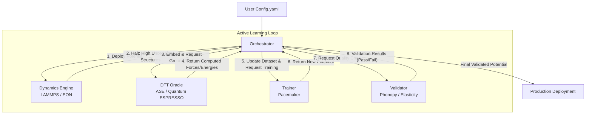

# MLIP Pipelines

An automated, zero-configuration pipeline for building, validating, and deploying machine learning interatomic potentials (MLIPs).


## Key Features

- **Zero-Configuration Execution**: Entire multi-stage generation from exploration to deployment executes autonomously from a single `config.yaml` or `.env` configuration.
- **Self-Healing DFT Oracle**: Automates Quantum ESPRESSO via `ase` with auto-adjusting parameters (e.g. `mixing_beta`, smearing) if SCF convergence fails.
- **Adaptive Exploration**: Dynamically decides exploration policies and tracks extreme extrapolations ("On-The-Fly" fail detection) to safely halt runaways.
- **Smart Sampling & D-Optimality**: Identifies high-gamma structures in LAMMPS and downselects actively using `pace_activeset` and localized generation.
- **Automated Validation**: Integrated `phonopy` stability and stress-strain calculations to guarantee elastic moduli verification and physical correctness.

## Architecture Overview

The `mlip-pipelines` architecture separates concerns across multiple domain models. The central Orchestrator manages the Active Learning state machine, coordinating the Dynamics Engine (LAMMPS/EON), the DFT Oracle (Quantum ESPRESSO), the Trainer (Pacemaker), and the Validator (Phonopy).



## Prerequisites

- **Python**: 3.12+
- **uv**: Dependency manager (`pip install uv`)
- **Docker**: (Optional, for running heavy components)
- External packages installed depending on real-mode execution needs (e.g., LAMMPS, Quantum ESPRESSO, Pacemaker)

## Installation & Setup

We recommend using `uv` to manage the environment and dependencies:

```bash
git clone <repository_url>
cd mlip-pipelines
uv sync
```

Set up your `.env` configuration from the provided example if one exists, or rely on `config.yaml`.

## Usage

The primary entry point will be the pipeline execution script. For user acceptance and demonstration, we include a Marimo interactive notebook that runs through the key active learning loops.

```bash
# To run the tutorial headlessly (using mock modes for fast validation)
uv run marimo run tutorials/uat_and_tutorial.py

# To open the interactive notebook
uv run marimo edit tutorials/uat_and_tutorial.py
```

## Development Workflow

The development is split across a 6-cycle iterative release plan prioritizing schema construction, engine integrations, and automated validation. We enforce strict codebase standards via `ruff` and `mypy`.

- **To run linters:**
  ```bash
  uv run ruff check .
  ```
- **To format code:**
  ```bash
  uv run ruff format .
  ```
- **To type check:**
  ```bash
  uv run mypy .
  ```
- **To run tests:**
  ```bash
  uv run pytest
  ```

## Project Structure

```text
project_root/
├── src/
│   ├── core/              # Main state machine (Orchestrator)
│   ├── domain_models/     # Pydantic Config Definitions & DTOs
│   ├── dynamics/          # LAMMPS / EON integration
│   ├── generators/        # Defect / Interface creation
│   ├── oracles/           # ASE/QE Self-healing interface & Embedding
│   ├── trainers/          # Pacemaker wrapper & Baseline potentials
│   └── validators/        # Validation suite & Phonopy checks
├── tests/                 # Unit and integration tests
├── dev_documents/         # System architecture and specifications
├── potentials/            # Stored generation potential files
├── tutorials/             # Marimo notebooks and UAT configurations
├── pyproject.toml         # Tooling configuration
└── README.md
```

## License

This project is licensed under the MIT License.
