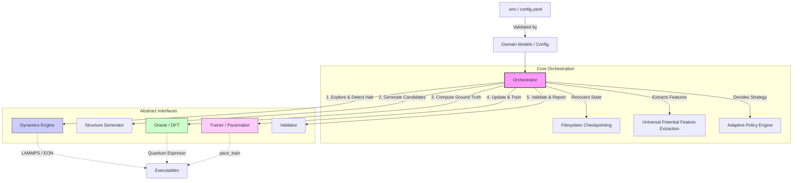

# System Architecture Document

## Summary
The high-efficiency Machine Learning Interatomic Potential (MLIP) construction and operation system is designed to democratise atomic simulations. By utilising the Pacemaker (ACE) engine as its core, this automated pipeline allows users—even those with limited computational physics expertise—to generate and deploy state-of-the-art MLIPs with minimal manual intervention. The system automates structure generation, Density Functional Theory (DFT) calculations, potential training, and molecular dynamics/kinetic Monte Carlo (MD/kMC) simulations in a single unified workflow governed by an intelligent Python-based Orchestrator.

## System Design Objectives
The architecture of this system is strictly guided by the objectives established in the requirements, focusing on automation, data efficiency, physical robustness, and scalability. The design ensures these goals are met while maintaining a modern, extensible software structure that maximises the reuse of existing components.

**1. Zero-Config Workflow (工数削減)**
The primary objective is to dramatically reduce the human effort required to construct an MLIP. The user should only need to provide a single initial configuration (e.g., via a `.env` file or `config.yaml`) defining the elements and basic system properties. From there, the Orchestrator autonomously manages the entire Active Learning (AL) pipeline—from initial structure sampling and DFT labelling to model training and MD deployment. By eliminating the need for users to write custom Python scripts or manually intervene between steps, the system achieves true "zero-config" operation. The configuration is robustly managed through strict Pydantic models (like `ProjectConfig`, `SystemConfig`, `DynamicsConfig`), ensuring that missing or invalid parameters are caught immediately at startup, preventing runtime failures.

**2. Maximum Data Efficiency (データ効率)**
Training an MLIP via random sampling requires an immense amount of computationally expensive DFT calculations. To overcome this, the system employs an Active Learning strategy driven by an Adaptive Exploration Policy Engine. This engine dynamically determines the optimal sampling strategy (e.g., varying temperatures, applying strains, or injecting defects) based on the material's inherent properties and the current model's uncertainty ($\gamma$ value). When the model encounters an uncertain configuration during MD/kMC exploration, the system halts, extracts only the highly uncertain local structures, and uses D-Optimality (via `pace_activeset`) to filter out redundant data. This ensures that the DFT Oracle is only invoked for the most informative structures, aiming to reduce the total DFT cost to less than 1/10th of traditional random sampling methods while achieving an energy RMSE of < 1 meV/atom.

**3. Physics-Informed Robustness (物理的堅牢性)**
A critical flaw in purely data-driven MLIPs is their tendency to fail catastrophically when extrapolating to unknown, high-energy states (e.g., atoms overlapping during a high-speed collision). To guarantee physical safety, the system enforces a physics-informed baseline. The Trainer configures Pacemaker to learn only the residual difference (Delta Learning) between the ab-initio data and a predefined repulsive baseline potential (such as Lennard-Jones or ZBL). During the MD inference phase, the Dynamics Engine strictly deploys a hybrid potential (e.g., `pair_style hybrid/overlay pace zbl`), guaranteeing that even if the neural network/polynomial component produces non-physical attractive forces at short distances, the baseline repulsive core will dominate, preventing simulation crashes (segmentation faults) and ensuring physical validity.

**4. Scalability and Extensibility (スケーラビリティと拡張性)**
The architecture is designed to scale seamlessly from small local workstations to large High-Performance Computing (HPC) environments. This is achieved by adhering to strict boundary management and the Dependency Injection pattern. The Orchestrator interacts with the underlying modules (Generator, Oracle, Trainer, Dynamics) exclusively through abstract base classes defined in `src/core/__init__.py`. This decoupled design allows the system to easily swap out implementations—for example, replacing the local ASE-based DFT Oracle with a distributed VASP runner, or switching the MD engine from LAMMPS to a custom kMC EON wrapper—without altering the core orchestration logic. Furthermore, the system includes built-in security constraints, strictly sandboxing directory operations and validating executables via SHA256 hashes to ensure secure deployment in shared HPC environments.

## System Architecture

The system follows a modular, decoupled architecture centered around a central `Orchestrator`. It leverages Dependency Injection to manage its interactions with four primary abstract components: `AbstractDynamics`, `AbstractGenerator`, `AbstractOracle`, and `AbstractTrainer`.

### Boundary Management and Separation of Concerns
To prevent the creation of "God Classes" and tightly coupled logic, the system enforces strict boundaries:
- **Orchestrator**: Acts solely as the state machine and data flow controller. It does not perform scientific calculations, file parsing, or direct subprocess execution.
- **Domain Models**: Pydantic models in `src/domain_models/` act as the single source of truth for configuration and data transfer objects (DTOs). They contain all validation logic, ensuring components only receive guaranteed-valid data.
- **Abstract Interfaces**: Defined in `src/core/__init__.py`, these enforce contracts. The Orchestrator calls `self.oracle.compute_batch()` without knowing whether the underlying engine is Quantum Espresso, VASP, or a mock for testing.



## Design Architecture

The design heavily relies on Pydantic to ensure type safety, immutability of configurations, and strict validation of inputs. This prevents misconfigurations from propagating deep into the scientific subroutines.

### File Structure Overview
```text
src/
├── core/
│   ├── __init__.py           # Abstract Base Classes (AbstractDynamics, etc.)
│   ├── exceptions.py         # Domain-specific exceptions (DynamicsHaltInterrupt)
│   └── orchestrator.py       # Core AL loop state machine
├── domain_models/
│   ├── __init__.py
│   ├── config.py             # Strict Pydantic models (ProjectConfig, SystemConfig)
│   └── dtos.py               # Data Transfer Objects (ExplorationStrategy)
├── dynamics/
│   ├── dynamics_engine.py    # LAMMPS MDInterface implementation
│   ├── eon_wrapper.py        # EON kMC implementation
│   └── security_utils.py     # Path traversal and env injection prevention
├── generators/
│   ├── adaptive_policy.py    # Policy Engine implementation
│   ├── defect_builder.py     # Defect injection utilities
│   └── structure_generator.py# ASE-based candidate generation
├── oracles/
│   └── dft_oracle.py         # Quantum Espresso DFT runner via ASE
├── trainers/
│   └── ace_trainer.py        # Pacemaker CLI wrapper
└── validators/
    ├── reporter.py           # HTML report generation
    └── validator.py          # Quality Assurance testing (RMSE, Phonon)
```

### Core Domain Models extending Existing Objects
The new requirements are seamlessly integrated by extending the existing Pydantic schemas in `src/domain_models/config.py`.
- **SystemConfig**: Extended to handle baseline potentials (`lj` vs `zbl`) to enforce physics-informed core repulsion. It also manages restricted directories to maintain sandbox security.
- **DynamicsConfig**: Extended to support hybrid MD/kMC parameters, EON binary paths, and strict executable hashing (`binary_hashes`) for security.
- **OracleConfig**: Manages specific Quantum Espresso parameters (`kspacing`, `smearing_width`) to ensure automated, self-healing DFT runs.
- **TrainerConfig**: Implements constraints for D-Optimality (`active_set_size`), delta learning (`baseline_potential`), and strict file size limits (`max_potential_size`) to prevent OOM errors.

## Implementation Plan

The project is decomposed into six sequential, valid cycles. Each cycle builds upon the previous one, maintaining a fully testable state.

### CYCLE01: Core Orchestrator & Configuration
- **Scope**: Finalise the strict Pydantic configuration schemas (`ProjectConfig`, `SystemConfig`, etc.) in `src/domain_models/config.py`. Enhance the `Orchestrator` in `src/core/orchestrator.py` to robustly manage the state machine, directory swapping, atomic file movements, state checkpointing (resuming from previous iterations), and exception handling without breaking existing abstract interfaces.
- **Goal**: Establish the secure, type-safe backbone of the pipeline capable of reading configurations, executing a mocked loop, and recovering gracefully from node preemptions/crashes.

### CYCLE02: Structure Generator & Adaptive Policy
- **Scope**: Implement the "Initial Exploration (Cold Start)" mechanism to extract intrinsic material features (e.g., predicted melting point, bulk modulus) using a universal potential API (e.g., M3GNet mock) if available. Implement the `AdaptiveExplorationPolicyEngine` to dynamically calculate `ExplorationStrategy` parameters (temperature, MD/MC ratio) based on these features. Enhance `StructureGenerator` to support robust local candidate generation (rattling) and complex synthetic interface building (e.g., FePt/MgO) using ASE.
- **Goal**: Provide intelligent, physics-informed structure sampling that avoids redundant random generation, driven by autonomously extracted material data.

### CYCLE03: Oracle (DFT Integration)
- **Scope**: Implement the `DFTManager` within `src/oracles/dft_oracle.py`. Focus on the self-healing calculation loop using Quantum Espresso (via ASE). Implement Periodic Embedding to securely and correctly wrap high-uncertainty clusters into valid periodic supercells before DFT execution.
- **Goal**: Ensure the system can autonomously calculate exact forces and energies, recovering gracefully from SCF convergence failures.

### CYCLE04: Trainer (Pacemaker Integration)
- **Scope**: Implement `PacemakerWrapper` in `src/trainers/ace_trainer.py`. Integrate the D-Optimality active set selection (`pace_activeset`) to filter structures. Enforce Delta Learning by composing the ACE potential with a ZBL/LJ baseline during training (`pace_train`). Implement strict subprocess memory and timeout limits to prevent the orchestrator from hanging indefinitely.
- **Goal**: Train highly accurate potentials securely and efficiently using only the most mathematically informative structures, preventing overfitting and resource exhaustion.

### CYCLE05: Dynamics Engine (LAMMPS & EON Integration)
- **Scope**: Finalise `MDInterface` and `EONWrapper` in `src/dynamics/`. Implement the logic to inject the hybrid potential (`pair_style hybrid/overlay`) into LAMMPS. Configure the uncertainty watchdog (`fix halt` based on $\gamma$ threshold) to interrupt the simulation when extrapolating. Explicitly manage the `eonclient` background process lifecycle to catch custom exit codes (e.g., `100` for halt) and avoid zombie processes.
- **Goal**: Enable continuous On-The-Fly (OTF) execution that safely halts before unphysical crashes occur across both MD and kMC domains.

### CYCLE06: Validator & Quality Assurance
- **Scope**: Implement the `Validator` and `Reporter` modules. Integrate routines to calculate Test Set RMSE, check mechanical stability (Born criteria), and generate visual HTML reports summarizing the MLIP's quality.
- **Goal**: Provide a rigorous, automated Quality Assurance gate before any potential is promoted to production use.

## Test Strategy

A robust testing strategy is crucial to verify the system without incurring massive computational costs or causing side-effects on the host environment.

### Strategy for Side-Effect-Free Testing
1. **Dependency Injection & Mocking**: Because the Orchestrator strictly uses abstract interfaces (`AbstractOracle`, etc.), we can inject mock implementations during unit testing. This allows us to test the active learning loop logic without invoking expensive LAMMPS or DFT subprocesses. Standard `pytest-mock` (e.g., `mocker.patch`) will be used specifically to patch subprocess calls in integration tests.
2. **Temporary Directories**: All file I/O (dataset creation, potential writing, `.env` loading) during testing MUST utilize the `pytest` `tmp_path` fixture. This guarantees isolation and automatic cleanup, completely preventing the test suite from polluting the developer's local filesystem.
3. **Environment Isolation**: The `ProjectConfig` validates `.env` files and environment variables strictly. Tests will mock `os.environ` entirely using `monkeypatch.setenv()` to ensure host environment variables do not bleed into the test context, maintaining high reproducibility.

### Cycle-Specific Testing Details
- **CYCLE01**: Unit tests for all Pydantic models ensuring strict rejection of invalid inputs (e.g., path traversal strings). Integration tests for the Orchestrator state machine using dummy implementations of the core interfaces.
- **CYCLE02**: Unit tests verifying the mathematical outputs of the Policy Engine. Integration tests for the `StructureGenerator` utilizing small, mocked ASE `Atoms` objects to verify rattling and interface generation without heavy computational overhead.
- **CYCLE03**: Unit tests for the DFTManager's retry logic. Mock the `ase.calculators.espresso.Espresso` execution to simulate SCF convergence failures and verify the self-healing parameter adjustments.
- **CYCLE04**: Unit tests for the Trainer's D-Optimality filtering logic. Mock the `subprocess.run` calls to `pace_train` and verify the CLI arguments are formatted correctly according to the strict templates.
- **CYCLE05**: Integration tests verifying that the `MDInterface` correctly parses LAMMPS dump files and accurately extracts atoms exceeding the $\gamma$ threshold. Mock the actual LAMMPS execution.
- **CYCLE06**: Unit tests for the Validator's mathematical routines (RMSE calculation, matrix operations for Born stability). Ensure the HTML reporter correctly structures the output data without requiring real potential evaluation.