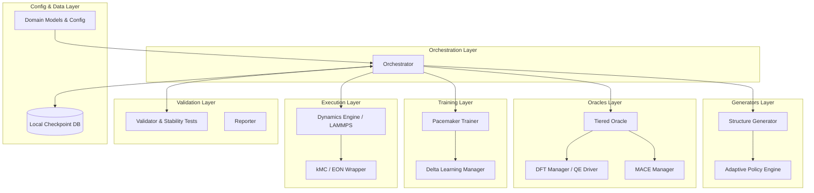

# PYACEMAKER NextGen Hierarchical Distillation Architecture

## 1. Summary

The PYACEMAKER project is evolving from its initial Phase 01 architecture into a NextGen Hierarchical Distillation Architecture. This evolution is driven by the pressing need to scale to High-Performance Computing (HPC) environments capable of running continuous molecular dynamics (MD) and kinetic Monte Carlo (kMC) simulations over millions of atoms and macroscopic time scales. The core innovation of this new architecture lies in its ability to seamlessly combine the extensive generalization capabilities of foundation models (such as MACE) with the extremely high speed and efficiency of the Atomic Cluster Expansion (ACE) formalism implemented via the Pacemaker framework.

In this system, we introduce a four-phase hierarchical distillation workflow. We start from a zero-shot distillation process where MACE-MP-0 provides a robust baseline of physical knowledge without requiring expensive Density Functional Theory (DFT) calculations for initial broad exploration. This foundational knowledge is distilled into an ACE potential using Delta Learning against a Lennard-Jones (LJ) baseline to guarantee physical constraints at short ranges. Following rigorous validation against various thermodynamic and mechanical properties, the system moves into an intelligent closed-loop operation mode. Here, molecular dynamics simulations run continuously, monitored by a two-tier uncertainty threshold system inspired by the FLARE architecture. When uncertainty spikes due to complex local physics—such as the formation of defects, surfaces, or unexpected chemical reactions—the system intelligently extracts a passivated local cluster. It refines this cluster using a tiered oracle approach (MACE followed by DFT if necessary), and incrementally updates the ACE potential through delta learning and replay buffers.

This entire process operates under a master-slave inversion paradigm, where the MD engine maintains continuous temporal evolution while invoking the Python orchestrator for on-the-fly refinement. This prevents the previous issue where simulations would completely restart from time zero after every update. The result is a robust, self-healing, and physically sound machine learning interatomic potential (MLIP) pipeline that drastically reduces manual configuration, minimizes expensive DFT calls, and absolutely prevents catastrophic simulation failures caused by extrapolation into unknown atomic configurations.

## 2. System Design Objectives

The primary objective of the PYACEMAKER NextGen architecture is to provide an end-to-end, zero-configuration pipeline for the generation, deployment, and autonomous refinement of machine learning interatomic potentials. In achieving this, we have defined several rigorous goals, constraints, and success criteria that guide the engineering and architectural decisions across the entire software stack.

Firstly, we aim to drastically reduce the human effort required to construct a state-of-the-art potential. Researchers and engineers should be able to provide a simple configuration file—detailing the constituent elements, basic simulation conditions, and available computational resources—and allow the system to handle the complex interplay of structure generation, oracle evaluation, and model training. The system must natively understand the physical and chemical context of the simulation to adapt its internal exploration policies dynamically. This "Zero-Config Workflow" is essential for democratizing access to high-fidelity atomistic simulations for users without extensive backgrounds in machine learning or computational physics.

Secondly, the architecture must ensure the absolute physical robustness and safety of the generated potentials. A known vulnerability of purely data-driven polynomial expansions like ACE is their tendency to exhibit unphysical attractive forces in the extrapolation regime. For example, when atoms are pushed uncharacteristically close together during high-energy collisions, the model might predict an energy minimum rather than a strong repulsion. To strictly prevent this, our design mandates the integration of a physical baseline potential, typically a Lennard-Jones (LJ) or Ziegler-Biersack-Littmark (ZBL) potential, via Delta Learning. The machine learning model strictly learns the many-body residual energy landscape. Consequently, the system guarantees that strong repulsive forces will always dominate at short interatomic distances, ensuring stable molecular dynamics without the risk of segmentation faults or lost atoms.

Thirdly, the system must achieve unprecedented data efficiency. Standard random sampling or naive active learning approaches often generate highly correlated snapshots that waste computational resources during the Density Functional Theory evaluation phase. By employing D-Optimality and DIRECT sampling via an intelligent active set selector, we filter out redundant structures. Furthermore, the introduction of a Tiered Oracle mechanism, leveraging foundation models like MACE as a surrogate oracle, allows us to filter out structures where the foundation model is already highly confident. Density Functional Theory is therefore strictly reserved for structures that exhibit genuine novelty and profound physical uncertainty, representing the true "long tail" of the distribution. This approach aims to reduce the total number of required DFT calls by an order of magnitude compared to traditional batch active learning methods while maintaining an energy Root Mean Square Error (RMSE) of less than 1 meV/atom and force RMSE of less than 0.05 eV/Å.

Fourthly, we must comprehensively solve the "Time-Continuity Break" problem observed in earlier iterations of the software. In previous versions, hitting an uncertainty threshold caused the molecular dynamics simulation to halt abruptly, and after retraining, the simulation restarted from scratch. This fundamental flaw prevented the observation of long-timescale phenomena like slow diffusion, grain boundary migration, or complex phase transformations. The new architecture enforces a master-slave inversion paradigm, effectively pausing the simulation, extracting the uncertain local region, refining the model on that specific region, and seamlessly resuming the exact same trajectory with updated forces. This continuous evolution is essential for scaling up to multi-million atom kinetic Monte Carlo simulations and bridging the gap between microsecond scale MD and macroscopic material properties.

Finally, the system operates under strict separation of concerns and robust boundary management. Every major functional unit—the Structure Generator, the Tiered Oracle, the Pacemaker Trainer, the Dynamics Engine, and the Validator—is meticulously encapsulated behind a well-defined interface. This ensures that the underlying implementation details, such as whether Quantum Espresso or VASP is used for DFT, or whether LAMMPS or EON is used for dynamics, do not leak into the core orchestration logic. We mandate the use of Pydantic-based configuration models to enforce strict schema validation at the system's entry points, preventing configuration drift and ensuring that all data passed between modules is strongly typed and physically coherent. Success will be measured by the ability to run stable simulations of multi-component alloys and complex oxides over nanosecond timescales, maintaining strict error bounds, while demonstrating seamless recovery from high-uncertainty events without user intervention.


## 3. System Architecture

The system architecture of the PYACEMAKER NextGen platform is constructed around a highly modular, decoupled, and hierarchical design. It revolves around a central Python Orchestrator which dictates the state machine transitions, surrounded by specialized domain modules that perform the heavy computational lifting. These modules interact exclusively through clearly defined interfaces, passing immutable data structures and ensuring that internal state mutations are tightly controlled and easily monitored.

### Explicit Rules on Boundary Management and Separation of Concerns

To prevent the formation of "God Classes" and spaghetti code that plagued earlier iterations, the architecture enforces strict boundary management across all sub-systems.
1. The Orchestrator module must never contain domain-specific scientific logic. It solely orchestrates the flow of data between the Generator, Oracle, Trainer, Dynamics Engine, and Validator. It uses standard abstract base classes and relies heavily on dependency injection to instantiate the correct concrete implementations based on the user's configuration.
2. The `domain_models` layer serves as the single source of truth for all configuration schemas and data transfer objects (DTOs). These Pydantic models must be completely independent of external simulation libraries like ASE or LAMMPS where possible, acting as pure Python data classes that validate physical constraints (e.g., ensuring radii are positive, ensuring thresholds are logically ordered).
3. The `Oracle` module is strictly responsible for providing energy, forces, and stresses for a given atomic structure. It must not know why it is calculating these values, nor should it care about how the structure was generated. It receives an `Atoms` object and returns an `Atoms` object with populated property arrays.
4. The `DynamicsEngine` encapsulates all interactions with molecular dynamics simulators. It must handle the translation of the abstract Pydantic configurations into simulator-specific input scripts (e.g., generating `in.lammps` files). The main Python process should never directly manipulate LAMMPS internal variables outside of this encapsulated module.
5. All file input/output and system calls must be heavily abstracted. The Orchestrator should not perform file writing directly; instead, dedicated file handler classes or the modules themselves should manage their local persistent states, utilizing temporary directories where appropriate to prevent filesystem pollution.

### Components and Data Flow

The architecture executes a sophisticated four-phase hierarchical distillation loop, driven by the Orchestrator's internal state machine:

**Phase 1: Zero-Shot Distillation and Baseline Construction.** The `Structure Generator` utilizes the `Adaptive Policy Engine` to dynamically create a massive, diverse pool of varied atomic structures across the relevant chemical space. The `MACE Manager` within the `Tiered Oracle` evaluates these structures extremely rapidly. It filters out structures where the foundation model is highly confident. The remaining highly confident structures are sent directly to the `Pacemaker Trainer`, which performs Delta Learning against a Lennard-Jones baseline to produce the initial base ACE potential. This phase avoids DFT entirely to bootstrap the system quickly.

**Phase 2: Rigorous Validation and Stress Testing.** The initial baseline potential is passed to the `Validator`. This module evaluates the potential across extensive, held-out test sets. Crucially, it performs physical stress tests: checking dynamic stability via phonon dispersion calculations (ensuring no imaginary frequencies exist) and verifying mechanical stability via elastic tensor derivation (ensuring Born stability criteria are met). Only if these rigorous validation metrics are met does the system proceed to active simulation.

**Phase 3: Intelligent Cutout and Continuous Operation.** The `Dynamics Engine` begins the long-timescale simulation. Driven by a two-tier uncertainty threshold system, it continuously monitors local extrapolation grades output by the ACE potential. Upon hitting a critical threshold (indicating the atoms have entered an unknown, potentially unphysical configuration), the engine pauses the simulation. An intelligent cutout script geometrically extracts a spherical cluster around this high-uncertainty epicenter. It applies MACE-based pre-relaxation to the boundary buffer zone and automatically passivates dangling surface bonds (e.g., capping a broken oxide bond with hydrogen). This ensures the cluster is physically correct and electrically neutral before being passed to the `DFT Manager` to obtain high-fidelity ground truth data without SCF divergence.

**Phase 4: Hierarchical Finetuning and Incremental Update.** The high-fidelity DFT data is first utilized to rapidly finetune the readout layers of the MACE model, effectively teaching the foundation model the specific, complex local physics of the failure event. The "awakened" MACE model then acts as a surrogate oracle to explosively generate thousands of related training points around the high-uncertainty region. Finally, the `Pacemaker Trainer` performs an incremental update (delta learning) on the ACE potential. It blends the new surrogate data with a fixed-size Replay Buffer of historical structures to strictly prevent catastrophic forgetting. The updated potential is hot-swapped into the working directory, and the `Dynamics Engine` seamlessly resumes the simulation from the exact moment it paused.

### Mermaid Diagram




## 4. Design Architecture

The design architecture is deeply rooted in robust Pydantic schemas and clearly delineated Python modules, ensuring that the system is both extensible and exceedingly safe to modify. The system will cleanly extend the existing `Phase 01` codebase, integrating new files and classes without destructively overwriting the validated core infrastructure.

### File Structure (ASCII Tree)

The directory layout reflects the strict separation of concerns, grouping related functionalities into isolated packages.

```text
.
├── src/
│   ├── core/
│   │   ├── __init__.py
│   │   ├── exceptions.py
│   │   ├── orchestrator.py         (Extended with robust 4-phase state machine logic)
│   │   ├── checkpoint.py           (NEW: SQLite/JSON state management for fault tolerance)
│   ├── domain_models/
│   │   ├── __init__.py
│   │   ├── config.py               (Extended with DistillationConfig, CutoutConfig, Thresholds)
│   │   ├── dtos.py                 (Extended with CutoutResult, FinetuneMetrics for data transfer)
│   ├── dynamics/
│   │   ├── __init__.py
│   │   ├── dynamics_engine.py      (Extended with master-slave resume logic and soft-starts)
│   │   ├── security_utils.py       (Centralized path and execution validation utilities)
│   │   ├── eon_wrapper.py
│   │   ├── eon_driver.py
│   ├── generators/
│   │   ├── __init__.py
│   │   ├── structure_generator.py
│   │   ├── adaptive_policy.py
│   │   ├── defect_builder.py
│   │   ├── extraction.py           (NEW: Intelligent spherical cluster cutout and auto-passivation)
│   ├── oracles/
│   │   ├── __init__.py
│   │   ├── dft_oracle.py           (Refactored to conform to BaseOracle interface)
│   │   ├── mace_manager.py         (NEW: Wrapper for executing the MACE foundation model)
│   │   ├── tiered_oracle.py        (NEW: Advanced routing logic between MACE and DFT)
│   ├── trainers/
│   │   ├── __init__.py
│   │   ├── ace_trainer.py          (Extended with replay buffer logic and incremental updates)
│   │   ├── finetune_manager.py     (NEW: PyTorch logic for fine-tuning the MACE model)
│   ├── validators/
│   │   ├── __init__.py
│   │   ├── validator.py
│   │   ├── stability_tests.py
│   │   ├── reporter.py
```

### Core Domain Pydantic Models Structure and Typing

The system relies heavily on strong typing and runtime validation provided by Pydantic. We will cleanly extend the existing `config.py` by introducing several crucial new models that plug seamlessly into the main `ProjectConfig`. This ensures the Orchestrator has a single, validated view of the user's intent.

1. **`ActiveLearningThresholds`**: This is a critical new model replacing simple threshold floats from Phase 01. It introduces `threshold_call_dft` and `threshold_add_train` to implement the sophisticated two-tier uncertainty system. `threshold_call_dft` dictates when the global simulation must pause, while `threshold_add_train` acts as a stricter local filter deciding exactly which atoms within the extracted cluster are informative enough to be added to the training set. It also includes a `smooth_steps` integer to prevent ephemeral thermal noise from triggering false-positive halts.
2. **`DistillationConfig`**: This schema defines the precise parameters for Phase 1. It contains string fields for the model path (e.g., `"mace-mp-0-medium"`), boolean flags to enable/disable the distillation phase, and integers governing the `sampling_structures_per_system` to control the breadth of the initial exploration.
3. **`CutoutConfig`**: This model meticulously dictates the geometric parameters for the intelligent cluster extraction algorithm. Key fields include `core_radius` (float) defining the critical region, `buffer_radius` (float) defining the protective outer shell, and boolean toggles for `enable_pre_relaxation` and `enable_passivation`. A strict Pydantic validator guarantees that `core_radius` is always physically smaller than `buffer_radius`.
4. **`LoopStrategyConfig`**: This model acts as the overarching policy director, pulling together the thresholds and managing global parameters like `replay_buffer_size` (to mitigate catastrophic forgetting) and `baseline_potential_type` (to enforce the physical LJ/ZBL safety nets).

### Clear Integration Points

The integration points are designed to be entirely additive and backward-compatible. The new `ActiveLearningThresholds` model will be added as an optional field within the existing configuration structures, gracefully falling back to legacy single-threshold behavior if the user provides an older configuration file.

The new `extraction.py` script will leverage the powerful, existing ASE manipulation utilities located in `security_utils.py` or `structure_generator.py`. The `extract_intelligent_cluster` function acts as a pure transformation: it takes a massive `Atoms` object and returns a smaller, physically sanitized `Atoms` object that can be seamlessly passed to the *existing* `DFTManager`. This design guarantees that no modifications to the delicate DFT execution logic are required.

Similarly, the `TieredOracle` will implement the exact same abstract base class as the existing `DFTManager`. This allows the Orchestrator to inject the `TieredOracle` into the pipeline wherever an oracle is needed, perfectly adhering to the Liskov Substitution Principle. The `TieredOracle` internally delegates to the new `MACEManager` or the existing `DFTManager` based on its internal routing logic, ensuring the complex DFT wrapper code remains pristine, isolated, and untouched by the routing logic.


## 5. Implementation Plan

### CYCLE01 Implementation

**Scope: Domain Models and Core Configurations**
This cycle establishes the foundational data structures and configuration schemas required for the entire NextGen architecture. The primary objective is to heavily modify `src/domain_models/config.py` to incorporate the new, robust Pydantic models. We will introduce the `DistillationConfig`, `ActiveLearningThresholds`, `CutoutConfig`, and `LoopStrategyConfig`. We will ensure that these new models are seamlessly and safely integrated into the existing `ProjectConfig` hierarchy.

The main goal here is to establish the single, unassailable source of truth for the entire automated pipeline. By defining these schemas rigorously at the very beginning, we lock in the API contract between all subsequent modules. We will implement extensive validation logic within these Pydantic models, checking for physical inconsistencies such as ensuring that the `core_radius` is strictly positive and measurably smaller than the `buffer_radius`. We will also write extensive, parameterized unit tests to guarantee that parsing complex configuration files (whether YAML or JSON) works flawlessly under all expected edge cases. This cycle acts as the solid bedrock for all future development and guarantees that bad user input is caught immediately at the boundary.
### CYCLE02 Implementation

**Scope: Intelligent Cluster Extraction and Passivation**
This cycle focuses entirely on solving one of the most critical physical challenges: the issue of dangling bonds and dipole divergence during active learning cutouts. When extracting a small cluster from a massive bulk simulation, breaking atomic bonds naively creates a highly reactive, unphysical vacuum interface that routinely causes DFT calculations to crash or yield garbage data. We will introduce `src/generators/extraction.py`. This entirely new module will house the `extract_intelligent_cluster` logic.

The implementation will involve sophisticated geometric algorithms to identify the high-uncertainty atoms, draw a perfect sphere defined by the configured `core_radius`, and then delineate an outer protective shell defined by the `buffer_radius`. We will implement logic to meticulously assign `force_weight` properties to these atoms (1.0 for the core, 0.0 for the buffer) so the downstream ML trainer knows which forces to trust. Crucially, we will build the auto-passivation system. This system will analyze the coordination numbers and electronegativities of the outermost buffer atoms. If an oxygen atom is suddenly missing its magnesium neighbor, the system will accurately cap it with a fractional hydrogen or dummy atom along the broken bond vector to neutralize the charge. Furthermore, we will implement the pre-relaxation step, which freezes the core atoms while allowing a fast surrogate model to relax the buffer and passivating atoms into a low-energy, physically plausible state before sending the cluster to the expensive DFT oracle.
### CYCLE03 Implementation

**Scope: Tiered Oracle and Foundation Model Integration**
This cycle focuses on integrating massive foundation models into the pipeline to execute the Zero-Shot Distillation phase efficiently. Relying solely on DFT is computationally prohibitive. We will create `src/oracles/mace_manager.py` to securely wrap the MACE-MP-0 foundation model. This wrapper will expose a clean, standardized API to predict potential energies, forces, and most importantly, precise epistemic uncertainties for any given atomic structure.

Following this, we will implement the routing logic in `src/oracles/tiered_oracle.py`. This new class will act as the master router and gatekeeper. When a batch of generated structures arrives, it will first send them all to the highly efficient `MACEManager`. It will then evaluate the returned uncertainty metrics against the strict configurations defined in CYCLE01. If the foundation model is highly confident in its prediction, the structure is accepted immediately, saving immense compute time. If the uncertainty exceeds the defined threshold, indicating novel physics, the `TieredOracle` will route that specific structure to the existing `DFTManager` for a rigorous, high-fidelity first-principles calculation. This cycle effectively cuts down the required compute budget by orders of magnitude while rigorously maintaining high physical fidelity in the resulting datasets.
### CYCLE04 Implementation

**Scope: Next-Gen Dynamics Engine and Master-Slave Resume**
This cycle addresses the critical "Time-Continuity Break" limitation and implements the master-slave resume capabilities. In Phase 01, the Python orchestrator launched LAMMPS as a monolithic external process that simply died upon hitting an error, losing all momentum and temporal state. We will extensively refactor `src/dynamics/dynamics_engine.py` to transition to a more integrated, continuous approach.

We will carefully implement the logic to handle the two-tier uncertainty thresholds directly within the LAMMPS script generation. The engine will monitor the extrapolation grade continuously. If it spikes above `threshold_call_dft` for `smooth_steps` consecutive steps, the engine will gracefully pause the simulation, write out the exact, perfect phase-space state (including all atom positions, velocities, and complex thermostat variables) to a binary restart file, and hand control safely back to the Python orchestrator. Crucially, we will also implement the "soft-start" protocol. When resuming a simulation after a machine learning potential update, the engine will automatically inject a strong, temporary Langevin thermostat for the first few hundred steps. This safely dissipates any sudden energy shocks or unphysical forces caused by the slightly altered potential energy surface, preventing explosive atom movements and guaranteeing simulation stability.
### CYCLE05 Implementation

**Scope: Hierarchical Finetuning and Incremental Updates**
This cycle completely overhauls the training pipeline, focusing on the `PacemakerTrainer` and introducing the new `FinetuneManager`. Traditional batch learning suffers from explosive scaling costs and catastrophic forgetting. We will create `src/trainers/finetune_manager.py` to handle the rapid, targeted finetuning of the MACE foundation model using the sparse, highly-valuable DFT data acquired during the active learning loop, effectively teaching the foundation model the specific local physics of the failure event.

Subsequently, we will drastically upgrade `src/trainers/ace_trainer.py`. We will implement the complex incremental update logic, configuring Pacemaker to perform Delta Learning rather than initiating training completely from scratch. We will build the robust replay buffer mechanism. This mechanism will systematically and randomly sample historical, stable structures and mix them seamlessly with the newly generated surrogate data to prevent the model from forgetting how to describe basic bulk phases. The trainer will be meticulously configured to stitch together the Lennard-Jones baseline with the dynamically updated ACE parameters, ensuring that the final output `potential.yace` file remains physically robust across all possible interatomic distance regimes.
### CYCLE06 Implementation

**Scope: E2E Integration, HPC Dispatch, and Checkpointing**
The final cycle binds all the independent, refactored components into a single, cohesive, fault-tolerant orchestration loop suitable for massive High-Performance Computing (HPC) environments. We will create `src/core/checkpoint.py` to implement a highly robust SQLite-based local database. This database will meticulously track the exact state of every generated structure, every DFT calculation, and every trainer epoch. If a massive HPC job is abruptly killed due to stringent wall-time limits, the system can instantly and safely resume from the exact last successful micro-operation without corrupting data.

We will drastically rewrite the main `src/core/orchestrator.py` to implement the full 4-phase workflow described in the system architecture. We will cleanly wire up the configurations, the generators, the tiered oracles, and the dynamics engine into a single continuous, unbreakable loop. Finally, we will implement the aggressive cleanup daemon. This daemon ensures that massive intermediate files, such as Quantum Espresso wavefunctions or gigabyte-sized LAMMPS dump files, are aggressively deleted or compressed immediately after they are successfully processed and committed to the database. This keeps the disk footprint minimal and prevents the pipeline from crashing due to exhausted storage quotas during long-running discovery campaigns.


## 6. Test Strategy

### CYCLE01 Test Strategy

**Strategy:**
The testing for this initial cycle is predominantly unit-testing focused, leveraging the Pytest framework extensively. Since the Pydantic models contain substantial, complex validation logic that governs the entire pipeline's safety, we must exhaustively test all possible boundary conditions and edge cases.
- **Unit Testing:** We will write highly parameterized tests injecting both valid and subtly invalid JSON/YAML dictionaries into the configuration models. We will rigorously test that missing optional fields correctly and safely fall back to their expected default values. We will test the custom field validators in detail, ensuring that logically impossible configurations—such as a negative extraction radius or overlapping threshold values—immediately raise the correct `ValueError` or `ValidationError` before any computation begins.
- **Side-Effect Management:** These tests represent entirely pure functions and therefore require absolutely no external mocking of system binaries. We will strictly ensure that testing the configuration parsing logic does not attempt to read random system-level environment variables or access local user files unless explicitly instructed via Pytest's `MonkeyPatch` utility, guaranteeing test reproducibility across all developer environments.
### CYCLE02 Test Strategy

**Strategy:**
Testing the intricate geometric logic of cluster extraction requires careful mocking of the atomic structures and the surrogate pre-relaxation tools to avoid unnecessary computational overhead during CI runs.
- **Unit Testing:** We will create highly controlled, synthetic `ase.Atoms` objects representing a simple crystal lattice with a distinct, known "defect" atom at the center. We will invoke `extract_intelligent_cluster` and assert mathematically that the resulting object has the correct `force_weight` arrays applied accurately based on the spatial distance from the epicenter. We will test the passivation logic by deliberately creating a broken MgO bond and asserting that a dummy passivating atom is successfully attached at the exact, physically correct bond vector and distance.
- **Integration Testing:** We will test the full extraction pipeline using a pre-calculated, complex test structure representing a realistic failure mode.
- **Side-Effect Management:** The `MACEManager` required for the pre-relaxation step must be heavily mocked using `unittest.mock.MagicMock`. We absolutely do not want to load a multi-gigabyte PyTorch foundation model during standard CI testing. We will strictly mock the `get_forces` and `get_potential_energy` methods of the surrogate calculator to return deterministic, hardcoded dummy values. This ensures the geometric logic runs instantly and reliably without invoking any external machine learning dependencies.
### CYCLE03 Test Strategy

**Strategy:**
Testing the `TieredOracle` involves meticulously verifying the complex routing logic based on the two-tier uncertainty thresholds.
- **Unit Testing:** We will instantiate the `TieredOracle` using a completely mocked `MACEManager` and a mocked `DFTManager`. By finely controlling the mocked uncertainty float output of the primary model, we will assert that structures falling below the defined threshold are returned immediately to the active set, while structures breaching the threshold correctly trigger a secondary call to the `DFTManager`. We will verify the batching logic and the final collation of the unified results array.
- **Integration Testing:** We will perform a comprehensive dry-run with a minimal, CPU-based mock MACE model to ensure the critical ASE calculator interface is correctly implemented. We will verify that predicted energies, force arrays, and uncertainty metrics are correctly populated into the `Atoms.info` and `Atoms.arrays` dictionaries without raising missing key exceptions later in the pipeline.
- **Side-Effect Management:** The `DFTManager` inherently attempts to write massive files and call external binaries (like Quantum Espresso). We will use Pytest's `tmp_path` fixture to strictly and forcefully confine any file I/O to temporary directories that are automatically destroyed post-test. We will deeply mock the actual `subprocess.run` calls to prevent any real DFT binaries from executing, ensuring the test suite remains lightning fast.
### CYCLE04 Test Strategy

**Strategy:**
The `DynamicsEngine` interacts heavily with complex file systems, generates custom scripts, and manages external simulator processes, requiring robust string testing and subprocess mocking.
- **Unit Testing:** We will rigorously test the automated generation of LAMMPS input scripts. We will assert that the crucial `pair_style hybrid/overlay` commands are correctly and perfectly formatted to ensure the baseline physical potentials engage properly. We will assert that the internal watchdog variables and `fix halt` commands are properly injected based exactly on the `ActiveLearningThresholds` configuration provided by the user, with no silent truncation or rounding errors.
- **Integration Testing:** We will systematically simulate a master-slave interruption. We will mock the external LAMMPS process to exit prematurely with a specific error code representing a threshold breach. We will then assert that the Python engine correctly catches this error, expertly parses the partial dump file, extracts the latest structural state without corruption, and successfully generates a pristine `restart` command block for the subsequent resumption run.
- **Side-Effect Management:** All LAMMPS executions will be entirely mocked. File parsing tests will strictly read from static, pre-generated, dummy `dump.lammps` files safely stored in the `tests/fixtures/` directory, ensuring extremely fast, isolated, and deterministic execution without requiring LAMMPS to be installed on the testing machine.
### CYCLE05 Test Strategy

**Strategy:**
Testing the `PacemakerTrainer` involves ensuring that highly complex command-line arguments and configuration YAMLs are correctly synthesized based on the state of the active learning loop.
- **Unit Testing:** We will meticulously test the delta learning configuration generator. We will assert that the dynamically generated `input.yaml` correctly specifies the Lennard-Jones baseline parameters for the exact atomic species present in the current dataset. We will thoroughly test the replay buffer logic, asserting mathematically that a fixed, exact number of random structures are correctly sampled from the historical dataset and concatenated seamlessly with the new data to form the training batch.
- **Integration Testing:** We will deeply test the `FinetuneManager` logic, ensuring the PyTorch freezing mechanisms are invoked correctly via CLI flags.
- **Side-Effect Management:** Training a real ACE model takes many hours and significant GPU resources. We will entirely mock the `pace_train` CLI execution. Our tests will merely verify that the correct arguments were passed to `subprocess.run` and that the resulting dummy `.yace` file is moved to the correct deployment directory. We will exclusively use temporary Pytest directories for all dataset generation and history file manipulation to prevent polluting the local workspace.
### CYCLE06 Test Strategy

**Strategy:**
The final integration cycle tests the overarching orchestration logic and the critical checkpointing database under simulated failure conditions.
- **Unit Testing:** We will rigorously test the `checkpoint.py` SQLite wrapper. We will assert that complex nested JSON records are correctly inserted, updated, and retrieved without data corruption. We will aggressively test the system's fault-tolerance by deliberately simulating a hard crash mid-transaction and asserting that the database rolls back to the previous consistent state correctly, preventing pipeline corruption.
- **Integration / E2E Testing:** We will run a fully mocked end-to-end cycle of the entire architecture. The central Orchestrator will be instantiated with mock Generators, mock Oracles, mock Trainers, and mock Dynamics Engines. We will assert that the Orchestrator successfully and sequentially transitions through Phase 1, Phase 2, Phase 3, and Phase 4 in the exact correct sequence, handling mock halt events properly and seamlessly looping back to the execution phase without deadlocking.
- **Side-Effect Management:** The SQLite database will be created strictly in memory (`sqlite:///:memory:`) during all testing to prevent polluting the disk or causing I/O bottlenecks. The aggressive artifact cleanup daemon will be tested by pointing it at a secure temporary directory populated with dummy `.wfc` files and asserting they are completely deleted after the simulated successful iteration.
