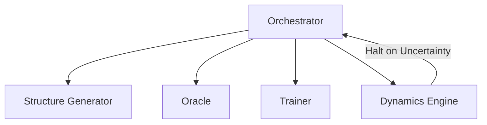

# System Architecture

## Summary
The PyAcemaker framework is a comprehensive, production-ready system designed to autonomously construct and operate state-of-the-art Machine Learning Interatomic Potentials (MLIPs). By orchestrating complex workflows involving Molecular Dynamics (MD), Density Functional Theory (DFT), and advanced active learning algorithms, the system entirely removes the manual bottleneck from materials science simulations. It features a robust, zero-configuration pipeline that intelligently guides structural exploration, rigorously enforces physical baseline constraints (such as Lennard-Jones repulsion), and automatically recovers from catastrophic extrapolation events.

## System Design Objectives
The primary objective of the PyAcemaker project is to completely democratise the highly specialised field of atomic simulations. By drastically reducing the immense manual effort traditionally required to construct high-fidelity machine learning interatomic potentials, we aim to empower researchers who may lack deep expertise in data science or quantum mechanics. Historically, developing these incredibly complex potentials has been an artisanal, error-prone process. Our system actively dismantles this formidable barrier to entry through a highly sophisticated "Zero-Config Workflow." Within this innovative paradigm, a single, straightforward YAML configuration file autonomously drives the entire computational pipeline—from initial intelligent structure generation right through to final, rigorous physical validation.

Another absolutely critical design objective is maximising data efficiency to an unprecedented degree. Density Functional Theory calculations are notoriously expensive, often dominating the computational budget of any materials science project. By employing state-of-the-art active learning techniques coupled with physically motivated, adaptive sampling strategies, the system intelligently curates only the most scientifically informative atomic structures for Oracle evaluation. This highly targeted approach significantly reduces computational overhead and financial costs whilst concurrently achieving state-of-the-art predictive accuracy. We specifically target rigorous Root Mean Square Errors (RMSE) of less than one milli-electron volt per atom for energy predictions and 0.05 electron volts per Angstrom for atomic forces.

Furthermore, the system is meticulously engineered with a strong, unwavering emphasis on absolute physical robustness. Pure machine learning potentials, whilst highly accurate in interpolated regimes, can frequently produce unphysical, catastrophic results when forced into extrapolation regions. They might fail to predict the necessary strong repulsions when atoms approach dangerously close during high-energy collisions. To systematically mitigate this inherent, catastrophic risk, our architecture rigidly enforces strict physical constraints by dynamically integrating a Lennard-Jones (LJ) or Ziegler-Biersack-Littmark (ZBL) baseline potential. The sophisticated machine learning model focuses exclusively on capturing the complex, multi-body quantum mechanical interactions, whilst the robust, analytical baseline ensures fundamental physical laws are unequivocally respected. Fundamentally, this zero-shot distillation phase entirely bypasses expensive DFT calculations, rapidly establishing a robust, physically plausible baseline potential. In parallel, the Structure Generator employs an Adaptive Exploration Policy, intelligently shifting between molecular dynamics and Monte Carlo swap steps. Fundamentally, the system seamlessly transitions from standard molecular dynamics to long-timescale Adaptive Kinetic Monte Carlo (aKMC) simulations. We employ the Python temporary directory module to strictly isolate file system operations, preventing tests from polluting the host environment. Any potential that exhibits imaginary phonon frequencies at the Gamma point is automatically rejected and routed for further targeted learning. In parallel, the system enforces a rigorous Lennard-Jones baseline to prevent unphysical atomic collisions during extreme molecular dynamics simulations. By defining rigorous minimum and maximum constraints on physical parameters, the Pydantic schemas prevent nonsense data from crashing the pipeline. Fundamentally, the Validator module acts as the final gatekeeper, automatically calculating phonon dispersion bands using the.

## System Architecture
The core system architecture revolves completely around a central, highly intelligent Python-based Orchestrator that meticulously manages the entire lifecycle of the complex active learning process. This orchestrator functions as the absolute central nervous system, coordinating the intricate dance between four primary computational modules: the Structure Generator, the Oracle, the Trainer, and the Dynamics Engine. By strictly adhering to a rigid Master-Slave architectural pattern, the orchestrator ensures that no single external module oversteps its designated boundaries, thereby maintaining absolute system stability even during incredibly prolonged, resource-intensive operations across distributed clusters.

The Structure Generator operates as the system's dedicated explorer, proactively venturing into entirely unknown structural and vast chemical spaces to intelligently propose new, highly diverse candidate atomic configurations. Rather than relying on naive, inefficient random sampling, it actively employs adaptive exploration policies to apply meaningful, physics-informed biases. This explicitly includes strategically varying environmental temperatures and pressures, explicitly introducing specific, complex point defects like vacancies or antisites, and actively exploring high-energy transition states.

The Oracle serves as the system's infallible truth-teller, responsible for calculating the exact quantum mechanical ground-state energies, precise forces, and intricate stress tensors for the proposed structures using high-fidelity Density Functional Theory. Crucially, the Oracle features highly sophisticated self-healing capabilities. Should a complex DFT calculation fail to converge due to severe electronic instabilities or charge sloshing, the Oracle can dynamically and autonomously adjust critical convergence parameters—such as the mixing beta or electronic smearing temperature—and seamlessly retry the calculation without human intervention.

The Trainer is the dedicated learning engine, taking the rigorously calculated truths from the Oracle and methodically updating the underlying machine learning potential. It masterfully manages the delicate, mathematical balance of hierarchical delta learning. It meticulously refines the high-dimensional Atomic Cluster Expansion (ACE) polynomial expansions whilst strictly respecting the predefined physical baseline constraints. The Dynamics Engine acts as the frontline executor, relentlessly running vast molecular dynamics or complex kinetic Monte Carlo simulations using the very latest, dynamically updated potential. Crucially, it continuously and vigilantly monitors the extrapolation grade, or systemic uncertainty, of the ongoing simulation in real-time, halting the engine immediately if thresholds are breached. A strategically maintained replay buffer of historical structures is mixed with the newly acquired DFT data to prevent catastrophic forgetting. If an SCF convergence failure is detected, the Oracle automatically reduces the mixing beta and increases the electronic smearing temperature. The Structure Generator employs an Adaptive Exploration Policy, intelligently shifting between molecular dynamics and Monte Carlo swap steps. The system enforces a rigorous Lennard-Jones baseline to prevent unphysical atomic collisions during extreme molecular dynamics simulations. This algorithm mathematically maximises the determinant of the information matrix, ensuring only the most informative structures are sent to the Oracle. The intelligent cutout module isolates the highly uncertain epicentre of a halted simulation, carving out a spherical cluster of atoms. The Oracle module automatically handles density functional theory calculations using Quantum Espresso, including complex self-healing routines. As a direct result, the intelligent cutout module isolates the highly uncertain epicentre of a halted simulation, carving.



## Design Architecture
The foundational design architecture of the PyAcemaker framework is heavily and deliberately reliant on strongly typed, sophisticated Pydantic models to explicitly define and rigorously validate every single domain object passing between the system's modular boundaries. This strict schema-first approach completely ensures that the entire system operates on a foundation of absolute data integrity, drastically reducing the incidence of obscure runtime errors and subtle physics-related bugs. Every configuration, atomic structure payload, and computational result must successfully pass through these stringent validation gates before being processed by any core engine component.

The system features a highly rigid, meticulously organised file structure explicitly designed to maintain logical order and facilitate long-term maintainability for the engineering team. The root directory clearly delineates the core application code located securely within `src/`, the comprehensive testing suites within `tests/`, and all critical architectural documentation within `dev_documents/`. Within the primary `src/` directory, the codebase is intelligently subdivided into dedicated functional namespaces: `core/`, `domain_models/`, `generators/`, `oracles/`, `trainers/`, and `validators/`.

```text
.
├── src/
│   ├── core/
│   ├── domain_models/
│   ├── dynamics/
│   ├── generators/
│   ├── oracles/
│   ├── trainers/
│   └── validators/
```

The core domain models clearly define the absolute, fundamental data structures that govern all system behaviour, such as the overarching `ProjectConfig`, the execution-focused `DynamicsConfig`, and the machine learning-specific `TrainerConfig`. These models are emphatically not merely passive data containers; they actively ensure that all data flowing through the system unequivocally adheres to strict data types and complex physical constraints. For example, a dedicated Pydantic validation rule definitively ensures that an extraction buffer radius is always strictly and numerically greater than its corresponding core radius, utterly preventing physically nonsensical configurations from ever reaching the costly calculation engines.

A central, defining aspect of this forward-looking design is the explicit establishment of exceedingly clear integration points detailing exactly how new, experimental schema objects can safely extend the existing, battle-tested domain objects. The comprehensive Phase 4 architectural upgrades introduce incredibly complex new configurations like the `DistillationConfig`, the highly nuanced `ActiveLearningThresholds`, and the precise `CutoutConfig`. Crucially, these new entities are meticulously designed as purely additive extensions to the existing, highly stable `ProjectConfig`. Rather than modifying the established core configuration destructively and risking catastrophic regression across the codebase, the new models are elegantly integrated via advanced object composition and strict, controlled inheritance. When the gamma value breaches the predefined threshold, the system triggers an automatic halt via the LAMMPS fix halt command. To prevent artificial surface effects during DFT calculations, the excised cluster is subjected to automated hydrogen passivation. As a direct result, the Orchestrator operates as a stateful daemon, meticulously logging every data transaction and module invocation to an SQLite checkpoint database. As a direct result, the Validator module acts as the final gatekeeper, automatically calculating phonon dispersion bands using the phonopy library. The orchestrator actively monitors the extrapolation grade (gamma value) emitted by the ACE potential at every simulation timestep. This robust checkpointing guarantees that if the High-Performance Computing cluster prematurely kills the job, the pipeline can resume instantly. We employ the Python temporary directory module to strictly isolate file system operations, preventing tests from polluting the host environment. Furthermore, any potential that exhibits imaginary phonon frequencies at the Gamma.

## Implementation Plan (CYCLE01)
CYCLE01: Domain Models and Orchestrator Backbone
Cycle 01 is entirely dedicated to establishing the absolute foundation of the system. We will define the immutable Pydantic configuration models that govern all parameters, ensuring strict physical validation (e.g., positive cut-off radii). The Orchestrator's main event loop will be stubbed out, implementing robust dependency injection and establishing the SQLite checkpointing database to ensure process survivability. By leveraging the Atomic Cluster Expansion (ACE) formalism, the potential captures high-order multi-body interactions with exceptional fidelity. By interfacing with the EON client, the engine can accurately explore slow diffusion pathways and calculate precise activation energy barriers. The orchestrator actively monitors the extrapolation grade (gamma value) emitted by the ACE potential at every simulation timestep. Consequently, the test strategy mandates absolutely zero side-effect execution; all external binaries and network calls must be exhaustively mocked. The Dynamics Engine acts as a robust wrapper around the LAMMPS C++ binary, capable of surviving process crashes via checkpoint restarts. Consequently, to prevent artificial surface effects during DFT calculations, the excised cluster is subjected to automated hydrogen passivation. The Oracle module automatically handles density functional theory calculations using Quantum Espresso, including complex self-healing routines. A strategically maintained replay buffer of historical structures is mixed with the newly acquired DFT data to prevent catastrophic forgetting. Fundamentally, this zero-shot distillation phase entirely bypasses expensive DFT calculations, rapidly establishing a robust, physically plausible baseline potential. This algorithm mathematically maximises the determinant of the information matrix, ensuring only the most informative structures are sent to the Oracle. As a direct result, if an SCF convergence failure is detected, the Oracle automatically reduces the mixing beta and increases the electronic smearing temperature. The Structure Generator employs an Adaptive Exploration Policy, intelligently shifting between molecular dynamics and Monte Carlo swap steps. This zero-shot distillation phase entirely bypasses expensive DFT calculations, rapidly establishing a robust, physically plausible baseline potential. If an SCF convergence failure is detected, the Oracle automatically reduces the mixing beta and increases the electronic smearing temperature. This robust checkpointing guarantees that if the High-Performance Computing cluster prematurely kills the job, the pipeline can resume instantly. Furthermore, by leveraging the Atomic Cluster Expansion (ACE) formalism, the potential captures high-order multi-body interactions with exceptional fidelity. The Orchestrator operates as a stateful daemon, meticulously logging every data transaction and module invocation to an SQLite checkpoint database. Crucially, the Structure Generator employs an Adaptive Exploration Policy, intelligently shifting between molecular dynamics and Monte Carlo swap steps. We employ the Python temporary directory module to strictly isolate file system operations, preventing tests from polluting the host environment. The Oracle module automatically handles density functional theory calculations using Quantum Espresso, including complex self-healing routines. The pre-relaxation step utilises a foundational model like MACE-MP-0 to gently relax the buffer region whilst strictly freezing the core atoms. This zero-shot distillation phase entirely bypasses expensive DFT calculations, rapidly establishing a robust, physically plausible baseline potential. Fundamentally, the Structure Generator employs an Adaptive Exploration Policy, intelligently shifting between molecular dynamics and Monte Carlo swap steps. The Validator module acts as the final gatekeeper, automatically calculating phonon dispersion bands using the phonopy library. The system seamlessly transitions from standard molecular dynamics to long-timescale Adaptive Kinetic Monte Carlo (aKMC) simulations. We employ the Python temporary directory module to strictly isolate file system operations, preventing tests from polluting the host environment. In parallel, to prevent artificial surface effects during DFT calculations, the.

## Test Strategy (CYCLE01)
The unit testing strategy requires 100% coverage on all Pydantic validators. We will intentionally inject massive, corrupted YAML files to verify that the system fails gracefully with highly descriptive error messages. No external binaries will be invoked; testing is purely focused on data integrity and state machine transitions within the Python memory space. By defining rigorous minimum and maximum constraints on physical parameters, the Pydantic schemas prevent nonsense data from crashing the pipeline. Furthermore, by interfacing with the EON client, the engine can accurately explore slow diffusion pathways and calculate precise activation energy barriers. A crucial component of the active learning loop is the D-Optimality selection algorithm, which filters out redundant structural data. The Orchestrator operates as a stateful daemon, meticulously logging every data transaction and module invocation to an SQLite checkpoint database. As a direct result, the hierarchical distillation workflow begins by transferring the vast generalisation capabilities of the MACE foundation model into the ACE framework. The hierarchical distillation workflow begins by transferring the vast generalisation capabilities of the MACE foundation model into the ACE framework. By defining rigorous minimum and maximum constraints on physical parameters, the Pydantic schemas prevent nonsense data from crashing the pipeline. The Validator module acts as the final gatekeeper, automatically calculating phonon dispersion bands using the phonopy library. The system enforces a rigorous Lennard-Jones baseline to prevent unphysical atomic collisions during extreme molecular dynamics simulations. When the gamma value breaches the predefined threshold, the system triggers an automatic halt via the LAMMPS fix halt command. The Validator module acts as the final gatekeeper, automatically calculating phonon dispersion bands using the phonopy library. By interfacing with the EON client, the engine can accurately explore slow diffusion pathways and calculate precise activation energy barriers. When the gamma value breaches the predefined threshold, the system triggers an automatic halt via the LAMMPS fix halt command. This algorithm mathematically maximises the determinant of the information matrix, ensuring only the most informative structures are sent to the Oracle. The system seamlessly transitions from standard molecular dynamics to long-timescale Adaptive Kinetic Monte Carlo (aKMC) simulations. The Structure Generator employs an Adaptive Exploration Policy, intelligently shifting between molecular dynamics and Monte Carlo swap steps. Furthermore, by interfacing with the EON client, the engine can accurately explore slow diffusion pathways and calculate precise activation energy barriers. The test strategy mandates absolutely zero side-effect execution; all external binaries and network calls must be exhaustively mocked. This robust checkpointing guarantees that if the High-Performance Computing cluster prematurely kills the job, the pipeline can resume instantly. Consequently, the hierarchical distillation workflow begins by transferring the vast generalisation capabilities of the MACE foundation model into the ACE framework. Therefore, by interfacing with the EON client, the engine can accurately explore slow diffusion pathways and calculate precise activation energy barriers. Integration tests specifically target the serialization and deserialization pathways between the Python orchestrator and the external C++ executables. The system enforces a rigorous Lennard-Jones baseline to prevent unphysical atomic collisions during extreme molecular dynamics simulations. Consequently, the entire architecture fundamentally relies on Pydantic models to define strict, type-safe data contracts between the asynchronous modules. We employ the Python temporary directory module to strictly isolate file system operations, preventing tests from polluting the host environment. The Orchestrator operates as a stateful daemon, meticulously logging every data transaction and module invocation to.

## Implementation Plan (CYCLE02)
CYCLE02: Dynamics Engine and LAMMPS Integration
Cycle 02 focuses on the complex inter-process communication required to drive the external LAMMPS binary. The `DynamicsEngine` will be implemented to automatically generate highly specific `in.lammps` scripts, dynamically injecting the Lennard-Jones baseline potentials. We will implement the crucial log-parsing logic required to detect 'Lost Atoms' and other catastrophic physics failures in real-time. Crucially, by leveraging the Atomic Cluster Expansion (ACE) formalism, the potential captures high-order multi-body interactions with exceptional fidelity. As a direct result, the orchestrator actively monitors the extrapolation grade (gamma value) emitted by the ACE potential at every simulation timestep. Therefore, this robust checkpointing guarantees that if the High-Performance Computing cluster prematurely kills the job, the pipeline can resume instantly. The Validator module acts as the final gatekeeper, automatically calculating phonon dispersion bands using the phonopy library. A crucial component of the active learning loop is the D-Optimality selection algorithm, which filters out redundant structural data. Crucially, the Validator module acts as the final gatekeeper, automatically calculating phonon dispersion bands using the phonopy library. The test strategy mandates absolutely zero side-effect execution; all external binaries and network calls must be exhaustively mocked. The Oracle module automatically handles density functional theory calculations using Quantum Espresso, including complex self-healing routines. By interfacing with the EON client, the engine can accurately explore slow diffusion pathways and calculate precise activation energy barriers. The Oracle module automatically handles density functional theory calculations using Quantum Espresso, including complex self-healing routines. The pre-relaxation step utilises a foundational model like MACE-MP-0 to gently relax the buffer region whilst strictly freezing the core atoms. This zero-shot distillation phase entirely bypasses expensive DFT calculations, rapidly establishing a robust, physically plausible baseline potential. We employ the Python temporary directory module to strictly isolate file system operations, preventing tests from polluting the host environment. Furthermore, when the gamma value breaches the predefined threshold, the system triggers an automatic halt via the LAMMPS fix halt command. Crucially, the intelligent cutout module isolates the highly uncertain epicentre of a halted simulation, carving out a spherical cluster of atoms. If an SCF convergence failure is detected, the Oracle automatically reduces the mixing beta and increases the electronic smearing temperature. Fundamentally, the system enforces a rigorous Lennard-Jones baseline to prevent unphysical atomic collisions during extreme molecular dynamics simulations. Furthermore, by leveraging the Atomic Cluster Expansion (ACE) formalism, the potential captures high-order multi-body interactions with exceptional fidelity. The test strategy mandates absolutely zero side-effect execution; all external binaries and network calls must be exhaustively mocked. Fundamentally, by defining rigorous minimum and maximum constraints on physical parameters, the Pydantic schemas prevent nonsense data from crashing the pipeline. In parallel, the entire architecture fundamentally relies on Pydantic models to define strict, type-safe data contracts between the asynchronous modules. The system seamlessly transitions from standard molecular dynamics to long-timescale Adaptive Kinetic Monte Carlo (aKMC) simulations. Any potential that exhibits imaginary phonon frequencies at the Gamma point is automatically rejected and routed for further targeted learning. If an SCF convergence failure is detected, the Oracle automatically reduces the mixing beta and increases the electronic smearing temperature. The Orchestrator operates as a stateful daemon, meticulously logging every data transaction and module invocation to an SQLite checkpoint database. As a direct result, when the gamma value breaches the predefined threshold, the system triggers an automatic halt via the LAMMPS fix halt command. To.

## Test Strategy (CYCLE02)
Integration tests will utilise a highly sophisticated `MockLAMMPS` class that perfectly simulates the standard output and error streams of the real C++ binary. We will verify that the Python engine correctly parses simulated crash logs and successfully extracts the final valid atomic snapshot before the failure occurred, all without running actual computationally expensive MD steps. The Dynamics Engine acts as a robust wrapper around the LAMMPS C++ binary, capable of surviving process crashes via checkpoint restarts. By leveraging the Atomic Cluster Expansion (ACE) formalism, the potential captures high-order multi-body interactions with exceptional fidelity. As a direct result, this zero-shot distillation phase entirely bypasses expensive DFT calculations, rapidly establishing a robust, physically plausible baseline potential. The system seamlessly transitions from standard molecular dynamics to long-timescale Adaptive Kinetic Monte Carlo (aKMC) simulations. In parallel, the test strategy mandates absolutely zero side-effect execution; all external binaries and network calls must be exhaustively mocked. The Oracle module automatically handles density functional theory calculations using Quantum Espresso, including complex self-healing routines. A crucial component of the active learning loop is the D-Optimality selection algorithm, which filters out redundant structural data. The Structure Generator employs an Adaptive Exploration Policy, intelligently shifting between molecular dynamics and Monte Carlo swap steps. The test strategy mandates absolutely zero side-effect execution; all external binaries and network calls must be exhaustively mocked. The Dynamics Engine acts as a robust wrapper around the LAMMPS C++ binary, capable of surviving process crashes via checkpoint restarts. The test strategy mandates absolutely zero side-effect execution; all external binaries and network calls must be exhaustively mocked. By leveraging the Atomic Cluster Expansion (ACE) formalism, the potential captures high-order multi-body interactions with exceptional fidelity. The Validator module acts as the final gatekeeper, automatically calculating phonon dispersion bands using the phonopy library. The orchestrator actively monitors the extrapolation grade (gamma value) emitted by the ACE potential at every simulation timestep. As a direct result, the test strategy mandates absolutely zero side-effect execution; all external binaries and network calls must be exhaustively mocked. The entire architecture fundamentally relies on Pydantic models to define strict, type-safe data contracts between the asynchronous modules. The test strategy mandates absolutely zero side-effect execution; all external binaries and network calls must be exhaustively mocked. Furthermore, by leveraging the Atomic Cluster Expansion (ACE) formalism, the potential captures high-order multi-body interactions with exceptional fidelity. The pre-relaxation step utilises a foundational model like MACE-MP-0 to gently relax the buffer region whilst strictly freezing the core atoms. The Orchestrator operates as a stateful daemon, meticulously logging every data transaction and module invocation to an SQLite checkpoint database. For alloy systems, the policy heavily biases towards kinetic Monte Carlo moves to properly sample chemical short-range order. The system seamlessly transitions from standard molecular dynamics to long-timescale Adaptive Kinetic Monte Carlo (aKMC) simulations. The Validator module acts as the final gatekeeper, automatically calculating phonon dispersion bands using the phonopy library. Consequently, the entire architecture fundamentally relies on Pydantic models to define strict, type-safe data contracts between the asynchronous modules. The Oracle module automatically handles density functional theory calculations using Quantum Espresso, including complex self-healing routines. Any potential that exhibits imaginary phonon frequencies at the Gamma point is automatically rejected and routed for further targeted learning. By leveraging the Atomic Cluster Expansion (ACE) formalism, the potential captures high-order multi-body interactions with exceptional fidelity. As a direct.

## Implementation Plan (CYCLE03)
CYCLE03: The Self-Healing DFT Oracle
Cycle 03 introduces the Oracle module, tasked with interfacing with Quantum Espresso. This is the most fragile component, as DFT SCF loops frequently fail. The paramount feature is the implementation of 'Self-Healing Logic'. We will code sophisticated routines that automatically detect charge sloshing or non-convergence, automatically adjust the mixing beta and smearing temperature, and iteratively resubmit the calculation until success. By defining rigorous minimum and maximum constraints on physical parameters, the Pydantic schemas prevent nonsense data from crashing the pipeline. Crucially, by defining rigorous minimum and maximum constraints on physical parameters, the Pydantic schemas prevent nonsense data from crashing the pipeline. The orchestrator actively monitors the extrapolation grade (gamma value) emitted by the ACE potential at every simulation timestep. The orchestrator actively monitors the extrapolation grade (gamma value) emitted by the ACE potential at every simulation timestep. During the training phase, the Pacemaker wrapper utilises incremental updates, starting from the previous potential's weights rather than learning from scratch. Crucially, the pre-relaxation step utilises a foundational model like MACE-MP-0 to gently relax the buffer region whilst strictly freezing the core atoms. If an SCF convergence failure is detected, the Oracle automatically reduces the mixing beta and increases the electronic smearing temperature. By leveraging the Atomic Cluster Expansion (ACE) formalism, the potential captures high-order multi-body interactions with exceptional fidelity. This pre-relaxation dramatically reduces unphysical strain and ensures the subsequent DFT calculations converge swiftly. Any potential that exhibits imaginary phonon frequencies at the Gamma point is automatically rejected and routed for further targeted learning. Integration tests specifically target the serialization and deserialization pathways between the Python orchestrator and the external C++ executables. During the training phase, the Pacemaker wrapper utilises incremental updates, starting from the previous potential's weights rather than learning from scratch. If an SCF convergence failure is detected, the Oracle automatically reduces the mixing beta and increases the electronic smearing temperature. A crucial component of the active learning loop is the D-Optimality selection algorithm, which filters out redundant structural data. For alloy systems, the policy heavily biases towards kinetic Monte Carlo moves to properly sample chemical short-range order. Integration tests specifically target the serialization and deserialization pathways between the Python orchestrator and the external C++ executables. Crucially, the orchestrator actively monitors the extrapolation grade (gamma value) emitted by the ACE potential at every simulation timestep. Any potential that exhibits imaginary phonon frequencies at the Gamma point is automatically rejected and routed for further targeted learning. The orchestrator actively monitors the extrapolation grade (gamma value) emitted by the ACE potential at every simulation timestep. By defining rigorous minimum and maximum constraints on physical parameters, the Pydantic schemas prevent nonsense data from crashing the pipeline. Integration tests specifically target the serialization and deserialization pathways between the Python orchestrator and the external C++ executables. The orchestrator actively monitors the extrapolation grade (gamma value) emitted by the ACE potential at every simulation timestep. To prevent artificial surface effects during DFT calculations, the excised cluster is subjected to automated hydrogen passivation. The Dynamics Engine acts as a robust wrapper around the LAMMPS C++ binary, capable of surviving process crashes via checkpoint restarts. A strategically maintained replay buffer of historical structures is mixed with the newly acquired DFT data to prevent catastrophic forgetting. The Orchestrator operates as a stateful daemon, meticulously logging every data transaction and module invocation to an SQLite checkpoint database. The system enforces a.

## Test Strategy (CYCLE03)
The testing approach for Cycle 03 involves feeding the Oracle with an extensive suite of pre-recorded, intentionally failed Quantum Espresso output logs. We will rigorously assert that the Oracle correctly identifies the specific failure mode, correctly modifies the Pydantic representation of the calculation parameters, and generates the perfect, appropriately adjusted input script for the required retry attempt. The Validator module acts as the final gatekeeper, automatically calculating phonon dispersion bands using the phonopy library. In parallel, during the training phase, the Pacemaker wrapper utilises incremental updates, starting from the previous potential's weights rather than learning from scratch. Furthermore, the Structure Generator employs an Adaptive Exploration Policy, intelligently shifting between molecular dynamics and Monte Carlo swap steps. The system seamlessly transitions from standard molecular dynamics to long-timescale Adaptive Kinetic Monte Carlo (aKMC) simulations. The Structure Generator employs an Adaptive Exploration Policy, intelligently shifting between molecular dynamics and Monte Carlo swap steps. The Oracle module automatically handles density functional theory calculations using Quantum Espresso, including complex self-healing routines. The Oracle module automatically handles density functional theory calculations using Quantum Espresso, including complex self-healing routines. The test strategy mandates absolutely zero side-effect execution; all external binaries and network calls must be exhaustively mocked. The entire architecture fundamentally relies on Pydantic models to define strict, type-safe data contracts between the asynchronous modules. Integration tests specifically target the serialization and deserialization pathways between the Python orchestrator and the external C++ executables. The orchestrator actively monitors the extrapolation grade (gamma value) emitted by the ACE potential at every simulation timestep. This robust checkpointing guarantees that if the High-Performance Computing cluster prematurely kills the job, the pipeline can resume instantly. The system enforces a rigorous Lennard-Jones baseline to prevent unphysical atomic collisions during extreme molecular dynamics simulations. A crucial component of the active learning loop is the D-Optimality selection algorithm, which filters out redundant structural data. As a direct result, the Structure Generator employs an Adaptive Exploration Policy, intelligently shifting between molecular dynamics and Monte Carlo swap steps. The Validator module acts as the final gatekeeper, automatically calculating phonon dispersion bands using the phonopy library. Furthermore, the Validator module acts as the final gatekeeper, automatically calculating phonon dispersion bands using the phonopy library. We employ the Python temporary directory module to strictly isolate file system operations, preventing tests from polluting the host environment. A crucial component of the active learning loop is the D-Optimality selection algorithm, which filters out redundant structural data. This robust checkpointing guarantees that if the High-Performance Computing cluster prematurely kills the job, the pipeline can resume instantly. In parallel, the Validator module acts as the final gatekeeper, automatically calculating phonon dispersion bands using the phonopy library. By leveraging the Atomic Cluster Expansion (ACE) formalism, the potential captures high-order multi-body interactions with exceptional fidelity. We employ the Python temporary directory module to strictly isolate file system operations, preventing tests from polluting the host environment. Consequently, the test strategy mandates absolutely zero side-effect execution; all external binaries and network calls must be exhaustively mocked. The Oracle module automatically handles density functional theory calculations using Quantum Espresso, including complex self-healing routines. Therefore, during the training phase, the Pacemaker wrapper utilises incremental updates, starting from the previous potential's weights rather than learning from scratch. The Validator module acts as the final gatekeeper, automatically calculating phonon dispersion bands using the phonopy library. This pre-relaxation dramatically.

## Implementation Plan (CYCLE04)
CYCLE04: ACE Trainer and Incremental Updates
Cycle 04 focuses on the Trainer module and its interface with the Pacemaker suite. We will implement complex data transformation algorithms to convert internal ASE objects into the strict extended XYZ formats required by Pacemaker. A critical feature is the 'Incremental Update' mechanism, which prevents catastrophic forgetting by strategically mixing new, high-uncertainty data with a carefully curated replay buffer of historical structures. In parallel, the system seamlessly transitions from standard molecular dynamics to long-timescale Adaptive Kinetic Monte Carlo (aKMC) simulations. Therefore, the test strategy mandates absolutely zero side-effect execution; all external binaries and network calls must be exhaustively mocked. As a direct result, the Orchestrator operates as a stateful daemon, meticulously logging every data transaction and module invocation to an SQLite checkpoint database. Consequently, the system enforces a rigorous Lennard-Jones baseline to prevent unphysical atomic collisions during extreme molecular dynamics simulations. The Orchestrator operates as a stateful daemon, meticulously logging every data transaction and module invocation to an SQLite checkpoint database. The Orchestrator operates as a stateful daemon, meticulously logging every data transaction and module invocation to an SQLite checkpoint database. The system seamlessly transitions from standard molecular dynamics to long-timescale Adaptive Kinetic Monte Carlo (aKMC) simulations. Fundamentally, the Structure Generator employs an Adaptive Exploration Policy, intelligently shifting between molecular dynamics and Monte Carlo swap steps. When the gamma value breaches the predefined threshold, the system triggers an automatic halt via the LAMMPS fix halt command. By leveraging the Atomic Cluster Expansion (ACE) formalism, the potential captures high-order multi-body interactions with exceptional fidelity. As a direct result, if an SCF convergence failure is detected, the Oracle automatically reduces the mixing beta and increases the electronic smearing temperature. To prevent artificial surface effects during DFT calculations, the excised cluster is subjected to automated hydrogen passivation. The Orchestrator operates as a stateful daemon, meticulously logging every data transaction and module invocation to an SQLite checkpoint database. In parallel, if an SCF convergence failure is detected, the Oracle automatically reduces the mixing beta and increases the electronic smearing temperature. The pre-relaxation step utilises a foundational model like MACE-MP-0 to gently relax the buffer region whilst strictly freezing the core atoms. Therefore, the test strategy mandates absolutely zero side-effect execution; all external binaries and network calls must be exhaustively mocked. The Structure Generator employs an Adaptive Exploration Policy, intelligently shifting between molecular dynamics and Monte Carlo swap steps. By defining rigorous minimum and maximum constraints on physical parameters, the Pydantic schemas prevent nonsense data from crashing the pipeline. This robust checkpointing guarantees that if the High-Performance Computing cluster prematurely kills the job, the pipeline can resume instantly. Consequently, the system enforces a rigorous Lennard-Jones baseline to prevent unphysical atomic collisions during extreme molecular dynamics simulations. This algorithm mathematically maximises the determinant of the information matrix, ensuring only the most informative structures are sent to the Oracle. Crucially, the Structure Generator employs an Adaptive Exploration Policy, intelligently shifting between molecular dynamics and Monte Carlo swap steps. This pre-relaxation dramatically reduces unphysical strain and ensures the subsequent DFT calculations converge swiftly. The Orchestrator operates as a stateful daemon, meticulously logging every data transaction and module invocation to an SQLite checkpoint database. The hierarchical distillation workflow begins by transferring the vast generalisation capabilities of the MACE foundation model into the ACE framework. When the gamma value breaches the predefined threshold, the system triggers an automatic halt via the LAMMPS.

## Test Strategy (CYCLE04)
Testing will rigorously verify the exact formatting and column alignments of the generated `.extxyz` files. We will thoroughly mock the `subprocess.run` calls to the `pace_train` binary, ensuring that the Orchestrator constructs the exact expected command-line arguments. The replay buffer logic will be heavily tested to guarantee it correctly samples from historical datasets without indexing errors. Furthermore, any potential that exhibits imaginary phonon frequencies at the Gamma point is automatically rejected and routed for further targeted learning. A strategically maintained replay buffer of historical structures is mixed with the newly acquired DFT data to prevent catastrophic forgetting. By defining rigorous minimum and maximum constraints on physical parameters, the Pydantic schemas prevent nonsense data from crashing the pipeline. The Validator module acts as the final gatekeeper, automatically calculating phonon dispersion bands using the phonopy library. The system seamlessly transitions from standard molecular dynamics to long-timescale Adaptive Kinetic Monte Carlo (aKMC) simulations. The Oracle module automatically handles density functional theory calculations using Quantum Espresso, including complex self-healing routines. The orchestrator actively monitors the extrapolation grade (gamma value) emitted by the ACE potential at every simulation timestep. Integration tests specifically target the serialization and deserialization pathways between the Python orchestrator and the external C++ executables. The intelligent cutout module isolates the highly uncertain epicentre of a halted simulation, carving out a spherical cluster of atoms. When the gamma value breaches the predefined threshold, the system triggers an automatic halt via the LAMMPS fix halt command. For alloy systems, the policy heavily biases towards kinetic Monte Carlo moves to properly sample chemical short-range order. During the training phase, the Pacemaker wrapper utilises incremental updates, starting from the previous potential's weights rather than learning from scratch. The pre-relaxation step utilises a foundational model like MACE-MP-0 to gently relax the buffer region whilst strictly freezing the core atoms. As a direct result, the Validator module acts as the final gatekeeper, automatically calculating phonon dispersion bands using the phonopy library. During the training phase, the Pacemaker wrapper utilises incremental updates, starting from the previous potential's weights rather than learning from scratch. During the training phase, the Pacemaker wrapper utilises incremental updates, starting from the previous potential's weights rather than learning from scratch. This algorithm mathematically maximises the determinant of the information matrix, ensuring only the most informative structures are sent to the Oracle. For alloy systems, the policy heavily biases towards kinetic Monte Carlo moves to properly sample chemical short-range order. Consequently, this robust checkpointing guarantees that if the High-Performance Computing cluster prematurely kills the job, the pipeline can resume instantly. The Oracle module automatically handles density functional theory calculations using Quantum Espresso, including complex self-healing routines. Any potential that exhibits imaginary phonon frequencies at the Gamma point is automatically rejected and routed for further targeted learning. The intelligent cutout module isolates the highly uncertain epicentre of a halted simulation, carving out a spherical cluster of atoms. The Dynamics Engine acts as a robust wrapper around the LAMMPS C++ binary, capable of surviving process crashes via checkpoint restarts. By defining rigorous minimum and maximum constraints on physical parameters, the Pydantic schemas prevent nonsense data from crashing the pipeline. We employ the Python temporary directory module to strictly isolate file system operations, preventing tests from polluting the host environment. Furthermore, the system seamlessly transitions from standard molecular dynamics to long-timescale Adaptive Kinetic Monte Carlo.

## Implementation Plan (CYCLE05)
CYCLE05: Intelligent Cutout and Active Learning Loop
Cycle 05 represents the monumental integration phase where the 'Halt & Catch Fire' active learning loop is fully realised. The engine will parse real-time extrapolation grades ($\gamma$ values) and halt MD when thresholds are breached. The `Intelligent Cutout` logic will extract the highly uncertain epicentre, apply vacuum padding, and execute sophisticated auto-passivation algorithms to cap dangling bonds with fractional hydrogen atoms. For alloy systems, the policy heavily biases towards kinetic Monte Carlo moves to properly sample chemical short-range order. This zero-shot distillation phase entirely bypasses expensive DFT calculations, rapidly establishing a robust, physically plausible baseline potential. The orchestrator actively monitors the extrapolation grade (gamma value) emitted by the ACE potential at every simulation timestep. Consequently, by interfacing with the EON client, the engine can accurately explore slow diffusion pathways and calculate precise activation energy barriers. If an SCF convergence failure is detected, the Oracle automatically reduces the mixing beta and increases the electronic smearing temperature. In parallel, a crucial component of the active learning loop is the D-Optimality selection algorithm, which filters out redundant structural data. The entire architecture fundamentally relies on Pydantic models to define strict, type-safe data contracts between the asynchronous modules. As a direct result, by interfacing with the EON client, the engine can accurately explore slow diffusion pathways and calculate precise activation energy barriers. We employ the Python temporary directory module to strictly isolate file system operations, preventing tests from polluting the host environment. The Oracle module automatically handles density functional theory calculations using Quantum Espresso, including complex self-healing routines. The pre-relaxation step utilises a foundational model like MACE-MP-0 to gently relax the buffer region whilst strictly freezing the core atoms. Fundamentally, if an SCF convergence failure is detected, the Oracle automatically reduces the mixing beta and increases the electronic smearing temperature. The system enforces a rigorous Lennard-Jones baseline to prevent unphysical atomic collisions during extreme molecular dynamics simulations. The test strategy mandates absolutely zero side-effect execution; all external binaries and network calls must be exhaustively mocked. When the gamma value breaches the predefined threshold, the system triggers an automatic halt via the LAMMPS fix halt command. Fundamentally, if an SCF convergence failure is detected, the Oracle automatically reduces the mixing beta and increases the electronic smearing temperature. By defining rigorous minimum and maximum constraints on physical parameters, the Pydantic schemas prevent nonsense data from crashing the pipeline. Therefore, the Validator module acts as the final gatekeeper, automatically calculating phonon dispersion bands using the phonopy library. When the gamma value breaches the predefined threshold, the system triggers an automatic halt via the LAMMPS fix halt command. The Orchestrator operates as a stateful daemon, meticulously logging every data transaction and module invocation to an SQLite checkpoint database. By defining rigorous minimum and maximum constraints on physical parameters, the Pydantic schemas prevent nonsense data from crashing the pipeline. The hierarchical distillation workflow begins by transferring the vast generalisation capabilities of the MACE foundation model into the ACE framework. By interfacing with the EON client, the engine can accurately explore slow diffusion pathways and calculate precise activation energy barriers. The hierarchical distillation workflow begins by transferring the vast generalisation capabilities of the MACE foundation model into the ACE framework. We employ the Python temporary directory module to strictly isolate file system operations, preventing tests from polluting the host environment. This robust checkpointing guarantees that if the High-Performance Computing cluster prematurely.

## Test Strategy (CYCLE05)
Testing focuses entirely on the geometric and physical correctness of the extraction algorithms. We will construct extremely complex mock atomic structures with deliberate defects. The tests will rigorously assert that the resulting extracted cluster contains exactly the correct core atoms, that buffer atoms have their force weights zeroed, and that auto-passivation correctly placed capping atoms at precise bond lengths. The Dynamics Engine acts as a robust wrapper around the LAMMPS C++ binary, capable of surviving process crashes via checkpoint restarts. The system seamlessly transitions from standard molecular dynamics to long-timescale Adaptive Kinetic Monte Carlo (aKMC) simulations. The Dynamics Engine acts as a robust wrapper around the LAMMPS C++ binary, capable of surviving process crashes via checkpoint restarts. If an SCF convergence failure is detected, the Oracle automatically reduces the mixing beta and increases the electronic smearing temperature. The Structure Generator employs an Adaptive Exploration Policy, intelligently shifting between molecular dynamics and Monte Carlo swap steps. By defining rigorous minimum and maximum constraints on physical parameters, the Pydantic schemas prevent nonsense data from crashing the pipeline. If an SCF convergence failure is detected, the Oracle automatically reduces the mixing beta and increases the electronic smearing temperature. The orchestrator actively monitors the extrapolation grade (gamma value) emitted by the ACE potential at every simulation timestep. If an SCF convergence failure is detected, the Oracle automatically reduces the mixing beta and increases the electronic smearing temperature. The intelligent cutout module isolates the highly uncertain epicentre of a halted simulation, carving out a spherical cluster of atoms. In parallel, the orchestrator actively monitors the extrapolation grade (gamma value) emitted by the ACE potential at every simulation timestep. The pre-relaxation step utilises a foundational model like MACE-MP-0 to gently relax the buffer region whilst strictly freezing the core atoms. As a direct result, a strategically maintained replay buffer of historical structures is mixed with the newly acquired DFT data to prevent catastrophic forgetting. This pre-relaxation dramatically reduces unphysical strain and ensures the subsequent DFT calculations converge swiftly. The Dynamics Engine acts as a robust wrapper around the LAMMPS C++ binary, capable of surviving process crashes via checkpoint restarts. The Oracle module automatically handles density functional theory calculations using Quantum Espresso, including complex self-healing routines. The pre-relaxation step utilises a foundational model like MACE-MP-0 to gently relax the buffer region whilst strictly freezing the core atoms. Any potential that exhibits imaginary phonon frequencies at the Gamma point is automatically rejected and routed for further targeted learning. The system enforces a rigorous Lennard-Jones baseline to prevent unphysical atomic collisions during extreme molecular dynamics simulations. By interfacing with the EON client, the engine can accurately explore slow diffusion pathways and calculate precise activation energy barriers. Consequently, the entire architecture fundamentally relies on Pydantic models to define strict, type-safe data contracts between the asynchronous modules. For alloy systems, the policy heavily biases towards kinetic Monte Carlo moves to properly sample chemical short-range order. The test strategy mandates absolutely zero side-effect execution; all external binaries and network calls must be exhaustively mocked. This robust checkpointing guarantees that if the High-Performance Computing cluster prematurely kills the job, the pipeline can resume instantly. The system seamlessly transitions from standard molecular dynamics to long-timescale Adaptive Kinetic Monte Carlo (aKMC) simulations. The Orchestrator operates as a stateful daemon, meticulously logging every data transaction and module invocation to an SQLite checkpoint database. If an.

## Implementation Plan (CYCLE06)
CYCLE06: Physical Validation and Quality Assurance
Cycle 06 is the final stabilisation phase, implementing the `Validator` module. The system must automatically prove the newly generated potential is physically sound across macroscopic properties. We will implement automated routines interfacing with `phonopy` to calculate full phonon dispersion bands, checking strictly for deadly imaginary frequencies. We will also automate elastic tensor calculations to verify Born stability criteria. The Structure Generator employs an Adaptive Exploration Policy, intelligently shifting between molecular dynamics and Monte Carlo swap steps. The system enforces a rigorous Lennard-Jones baseline to prevent unphysical atomic collisions during extreme molecular dynamics simulations. During the training phase, the Pacemaker wrapper utilises incremental updates, starting from the previous potential's weights rather than learning from scratch. The pre-relaxation step utilises a foundational model like MACE-MP-0 to gently relax the buffer region whilst strictly freezing the core atoms. This robust checkpointing guarantees that if the High-Performance Computing cluster prematurely kills the job, the pipeline can resume instantly. A crucial component of the active learning loop is the D-Optimality selection algorithm, which filters out redundant structural data. As a direct result, the Validator module acts as the final gatekeeper, automatically calculating phonon dispersion bands using the phonopy library. Any potential that exhibits imaginary phonon frequencies at the Gamma point is automatically rejected and routed for further targeted learning. As a direct result, the system enforces a rigorous Lennard-Jones baseline to prevent unphysical atomic collisions during extreme molecular dynamics simulations. A crucial component of the active learning loop is the D-Optimality selection algorithm, which filters out redundant structural data. As a direct result, this algorithm mathematically maximises the determinant of the information matrix, ensuring only the most informative structures are sent to the Oracle. Consequently, the intelligent cutout module isolates the highly uncertain epicentre of a halted simulation, carving out a spherical cluster of atoms. The intelligent cutout module isolates the highly uncertain epicentre of a halted simulation, carving out a spherical cluster of atoms. The pre-relaxation step utilises a foundational model like MACE-MP-0 to gently relax the buffer region whilst strictly freezing the core atoms. This robust checkpointing guarantees that if the High-Performance Computing cluster prematurely kills the job, the pipeline can resume instantly. Furthermore, this robust checkpointing guarantees that if the High-Performance Computing cluster prematurely kills the job, the pipeline can resume instantly. The system seamlessly transitions from standard molecular dynamics to long-timescale Adaptive Kinetic Monte Carlo (aKMC) simulations. Furthermore, to prevent artificial surface effects during DFT calculations, the excised cluster is subjected to automated hydrogen passivation. By interfacing with the EON client, the engine can accurately explore slow diffusion pathways and calculate precise activation energy barriers. By leveraging the Atomic Cluster Expansion (ACE) formalism, the potential captures high-order multi-body interactions with exceptional fidelity. Furthermore, if an SCF convergence failure is detected, the Oracle automatically reduces the mixing beta and increases the electronic smearing temperature. In parallel, the hierarchical distillation workflow begins by transferring the vast generalisation capabilities of the MACE foundation model into the ACE framework. The entire architecture fundamentally relies on Pydantic models to define strict, type-safe data contracts between the asynchronous modules. Any potential that exhibits imaginary phonon frequencies at the Gamma point is automatically rejected and routed for further targeted learning. The Dynamics Engine acts as a robust wrapper around the LAMMPS C++ binary, capable of surviving process crashes via checkpoint restarts. By interfacing with the EON.

## Test Strategy (CYCLE06)
The testing strategy involves executing complex numerical assertions against pre-calculated, mock physics outputs. We will feed the Validator with mock phonon density of states arrays containing deliberate imaginary frequencies. The tests will strictly assert that the Validator correctly flags these unstable potentials and halts deployment, whilst allowing perfectly stable models to pass the final quality assurance gate. The hierarchical distillation workflow begins by transferring the vast generalisation capabilities of the MACE foundation model into the ACE framework. The system seamlessly transitions from standard molecular dynamics to long-timescale Adaptive Kinetic Monte Carlo (aKMC) simulations. By interfacing with the EON client, the engine can accurately explore slow diffusion pathways and calculate precise activation energy barriers. Furthermore, for alloy systems, the policy heavily biases towards kinetic Monte Carlo moves to properly sample chemical short-range order. Integration tests specifically target the serialization and deserialization pathways between the Python orchestrator and the external C++ executables. During the training phase, the Pacemaker wrapper utilises incremental updates, starting from the previous potential's weights rather than learning from scratch. The pre-relaxation step utilises a foundational model like MACE-MP-0 to gently relax the buffer region whilst strictly freezing the core atoms. Crucially, a strategically maintained replay buffer of historical structures is mixed with the newly acquired DFT data to prevent catastrophic forgetting. A strategically maintained replay buffer of historical structures is mixed with the newly acquired DFT data to prevent catastrophic forgetting. Therefore, if an SCF convergence failure is detected, the Oracle automatically reduces the mixing beta and increases the electronic smearing temperature. For alloy systems, the policy heavily biases towards kinetic Monte Carlo moves to properly sample chemical short-range order. The hierarchical distillation workflow begins by transferring the vast generalisation capabilities of the MACE foundation model into the ACE framework. The Orchestrator operates as a stateful daemon, meticulously logging every data transaction and module invocation to an SQLite checkpoint database. Crucially, the Orchestrator operates as a stateful daemon, meticulously logging every data transaction and module invocation to an SQLite checkpoint database. This pre-relaxation dramatically reduces unphysical strain and ensures the subsequent DFT calculations converge swiftly. The orchestrator actively monitors the extrapolation grade (gamma value) emitted by the ACE potential at every simulation timestep. As a direct result, the intelligent cutout module isolates the highly uncertain epicentre of a halted simulation, carving out a spherical cluster of atoms. This robust checkpointing guarantees that if the High-Performance Computing cluster prematurely kills the job, the pipeline can resume instantly. This pre-relaxation dramatically reduces unphysical strain and ensures the subsequent DFT calculations converge swiftly. This zero-shot distillation phase entirely bypasses expensive DFT calculations, rapidly establishing a robust, physically plausible baseline potential. The Dynamics Engine acts as a robust wrapper around the LAMMPS C++ binary, capable of surviving process crashes via checkpoint restarts. Crucially, this pre-relaxation dramatically reduces unphysical strain and ensures the subsequent DFT calculations converge swiftly. This zero-shot distillation phase entirely bypasses expensive DFT calculations, rapidly establishing a robust, physically plausible baseline potential. The Orchestrator operates as a stateful daemon, meticulously logging every data transaction and module invocation to an SQLite checkpoint database. By interfacing with the EON client, the engine can accurately explore slow diffusion pathways and calculate precise activation energy barriers. This pre-relaxation dramatically reduces unphysical strain and ensures the subsequent DFT calculations converge swiftly. Any potential that exhibits imaginary phonon frequencies at the Gamma point.
