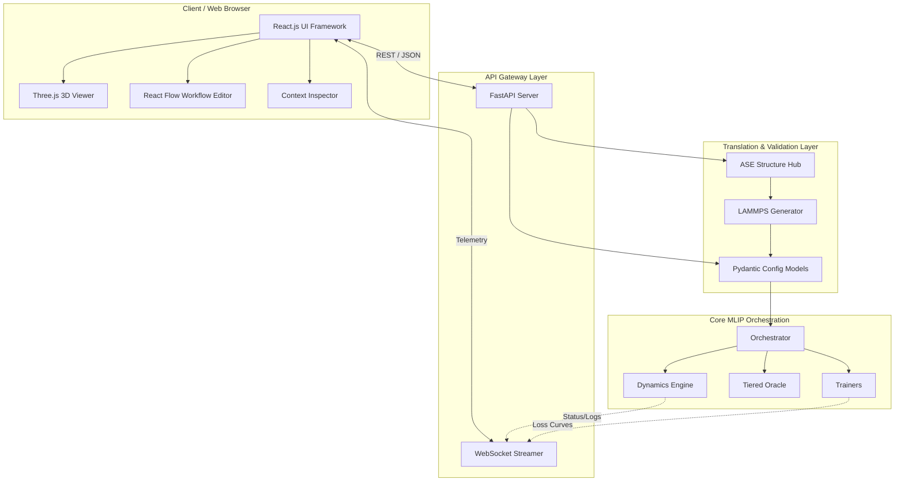

# SYSTEM ARCHITECTURE: Adaptive-MLIP GUI Platform

## 1. Summary

The Adaptive-MLIP framework is an advanced, fully automated Machine Learning Interatomic Potential (MLIP) construction and operational pipeline. It seamlessly integrates first-principles calculations (Density Functional Theory, DFT), Machine Learning Potentials (MLIPs like MACE and ACE), Molecular Dynamics (MD), and Kinetic Monte Carlo (kMC) into a highly cohesive system. However, as the computational backend leverages cutting-edge Foundation Models, the complexity of configuring and operating these workflows has grown significantly.

To address this, we are introducing the Next-Generation Graphical User Interface (GUI) Platform. This platform acts as an intelligent compiler layer that translates the user's high-level research intent—such as the target material, the desired physical property, and the available computational budget—into a robust backend configuration. By employing a modern web-based technology stack (React.js, Three.js, FastAPI), the GUI removes the necessity for users to manually edit complex text-based configuration files, write convoluted LAMMPS geometry scripts, or tweak obscure hyperparameters to prevent catastrophic forgetting. Instead, it provides a seamless, intent-driven user experience where complex domain logic is managed entirely by the system.

The primary function of this system is to bridge the massive cognitive gap between materials science objectives and the intricate syntax of high-performance computing tools. By adopting a declarative, intent-driven approach, we ensure that experimentalists and computational researchers can collaborate without being hindered by boilerplate code or subtle configuration errors. The system is fundamentally composed of a highly interactive React-based frontend and a robust, asynchronously driven FastAPI backend. The frontend handles the complexities of 3D visualization, region tagging, and parameter abstraction, while the backend rigorously enforces physical constraints, validates inputs against security vulnerabilities, and translates abstract user intent into mathematically precise configurations and executable LAMMPS scripts. This architecture not only enhances usability but drastically reduces the operational friction that currently bottlenecks advanced materials discovery. By providing real-time telemetry, the system also empowers users to dynamically monitor their simulations, offering immediate visual feedback on complex active learning loops, making the opaque ML model training process completely transparent and manageable. This transparency is key to building trust in AI-driven physics engines. In summary, the Adaptive-MLIP GUI Platform is not just a visual wrapper, but a sophisticated, semantic translation engine designed to democratize access to the world’s most powerful molecular simulation technologies.

## 2. System Design Objectives

The core objective of the Adaptive-MLIP GUI Platform is to radically lower the barrier to entry for computational materials science by transforming the traditional Command-Line Interface (CLI) workflow into a highly intuitive, visual, and intent-driven process. Historically, researchers have spent countless hours debugging configuration syntax, manual spatial partitioning for molecular dynamics, and intricate active-learning loops. This cognitive load detracts from the actual scientific research. The primary objective is to eliminate this friction entirely.

To achieve this, the system is designed around three fundamental principles. First, the Intent-Driven Approach dictates that the user should only specify what they want to achieve, not how the system should achieve it. The GUI abstracts away complex parameters such as `learning_rate` or the intricate arguments of LAMMPS commands (e.g., `fix gcmc`). Instead, the user defines the target material, the property of interest, and the computational budget. The intelligent backend then provisions the optimal calculation pipeline and hyperparameters automatically. By shielding the user from the raw syntax of the underlying engines, the platform guarantees that syntactic errors are entirely eliminated from the user's workflow, allowing them to focus exclusively on the physics and chemistry of their problem domain.

Second, the system enforces Complete Abstraction and Smart Trade-Off Management. Active learning loops involve complex thresholds for triggering DFT re-calculations. Instead of exposing these intricate numerical thresholds to the user, the GUI presents a single, intelligent "Accuracy vs. Speed" slider. Moving this slider dynamically adjusts a host of underlying hyperparameters—such as extrapolation grade thresholds and sampling intervals—using predefined non-linear functions. This abstraction ensures that users can make high-level decisions about resource allocation without needing to understand the deep mathematical intricacies of the active learning algorithms. The system bears the responsibility of maintaining physical correctness and computational efficiency based on the user's selected trade-off. This mechanism not only simplifies the configuration process but also introduces a highly robust safety net; because the hyperparameter mappings are mathematically pre-validated by domain experts, the likelihood of a user inadvertently setting a combination of parameters that leads to catastrophic simulation divergence is virtually eliminated. This drastically increases the success rate of complex, long-running computational jobs on expensive HPC clusters.

Third, the system provides Visual and Semantic State Management. Defining simulation regions and atomic groups using absolute coordinates in text files is a major source of errors. The GUI solves this by offering a 3D interactive viewer where users can visually select atoms or regions (e.g., painting the bottom layer of a slab to freeze it). These semantic actions are captured by the frontend, stored as tags in an Atomic Simulation Environment (ASE) object, and seamlessly translated into error-free LAMMPS commands by the backend generator. This ensures that the user's mental model perfectly aligns with the simulation's state. Furthermore, this semantic approach enables a level of dynamic adaptability previously impossible; if a structure undergoes significant deformation during a simulation, the topologically defined tags remain robustly attached to their respective atoms, whereas static geometric region definitions would silently fail and apply boundary conditions to the wrong spatial volume.

Success for this project is defined by the ability of a non-expert user—such as an experimental researcher or a process engineer—to rapidly construct a customized, robust MLIP and execute continuous On-The-Fly (OTF) calculations without ever encountering a syntax error, a catastrophic simulation crash due to poorly chosen hyperparameters, or the need to edit a configuration file manually. The system must be robust, reliable, and capable of gracefully handling transient failures through its established checkpointing and state resumption mechanisms. Furthermore, the platform must achieve strict sub-second response times for all API configuration validations to provide a snappy, modern web experience, and it must securely handle all data transitions, fully protecting the underlying HPC environment from arbitrary code execution or path traversal injection attacks.

## 3. System Architecture

The architecture of the Adaptive-MLIP GUI Platform is a modern, distributed, and highly modular system designed to support complex scientific workflows while maintaining strict separation of concerns. The system is logically divided into a client-side frontend and a server-side backend, communicating via RESTful APIs and real-time WebSockets. This separation ensures that the computationally heavy backend can run on High-Performance Computing (HPC) clusters or cloud infrastructure, while the lightweight frontend provides a responsive and interactive user experience in the web browser.

The frontend is built using React.js and TypeScript, ensuring strong typing, maintainability, and scalability. It features a Three-Pane Layout. The Left Pane utilizes Three.js (or NGLView) for robust 3D visualization, capable of rendering large atomic trajectories and displaying real-time uncertainty heatmaps. The Bottom Pane implements a node-based workflow editor using React Flow, allowing users to construct Directed Acyclic Graphs (DAGs) representing their simulation pipelines. The Right Pane is a Context-Aware Inspector that provides progressive disclosure of settings, showing basic controls (like the Accuracy/Speed slider) by default and advanced options only when requested. This client architecture ensures that the presentation layer remains completely decoupled from the heavy physics simulations, relying entirely on structured JSON payloads for state synchronization.

The backend is driven by Python, primarily utilizing FastAPI to expose a highly performant and asynchronous API. The backend acts as the critical bridge between the visual frontend and the core Adaptive-MLIP orchestration engine. When a user configures a workflow in the GUI, the frontend serializes the state into a structured JSON format. The FastAPI backend receives this state and maps it onto the system's strict Pydantic Domain Models (e.g., `ProjectConfig`, `LoopStrategyConfig`). This ensures that all inputs are rigorously validated before any computation begins. By executing the validation asynchronously via standard ASGI methodologies, the FastAPI server can handle hundreds of concurrent user sessions connecting to the same cluster endpoint, facilitating large-scale organizational deployments.

A central component of the backend is the ASE (Atomic Simulation Environment) Structure Hub. Visual selections made in the frontend's 3D viewer (such as freezing a layer of atoms) are transmitted to the backend, which encodes these selections as integer tags within an ASE `Atoms` object. The `lammps_generator.py` module then consumes this ASE object to automatically generate the necessary LAMMPS `region`, `group`, and `fix` commands, completely shielding the user from LAMMPS syntax. This generation pipeline utilizes secure string formatting and explicitly bypasses vulnerable shell executions, enforcing strict API boundaries between the Python orchestration logic and the underlying C++ binaries.

Real-time monitoring is achieved by extending the backend's telemetry hooks to stream data—such as MACE prediction uncertainties, training loss curves, and DFT trigger events—over WebSockets to the frontend. This allows the GUI to update the 3D viewer's heatmaps and the dashboard's graphs dynamically as the simulation progresses.

**Boundary Management and Separation of Concerns:**
The architecture strictly enforces boundary management to prevent the "God Class" anti-pattern and tightly coupled logic.
- **Frontend boundaries:** The frontend is strictly a presentation and interaction layer; it contains zero physics or chemistry logic. It cannot calculate potentials, execute trajectories, or parse raw binary restart files.
- **API Gateway Boundaries:** The FastAPI layer is strictly an API gateway and translation layer; its sole responsibility is to convert REST/WebSocket messages into valid Pydantic models and orchestrator commands. It must not contain internal physics loops or file I/O operations beyond configuration persistence.
- **Core Domain Boundaries:** The core engine (`src/core/orchestrator.py`, `src/dynamics/`, etc.) remains entirely agnostic of the GUI. It only understands Pydantic configuration models. It does not know what React or FastAPI is. This dependency injection approach ensures that the core engine can still be run purely via CLI if desired, and the GUI can evolve independently without breaking the underlying physics engine.
- **Security Boundaries:** Input sanitization is performed exclusively at the Pydantic instantiation layer, meaning that no unvalidated strings ever penetrate the orchestrator's core routines.



## 4. Design Architecture

The Design Architecture focuses on how the core domain concepts are represented, primarily through robust Pydantic schemas. The Adaptive-MLIP system is entirely configured and driven by a deeply nested, strictly validated Pydantic model (`ProjectConfig`). The new GUI requirements necessitate extending these models to capture the intent-driven parameters (like the Accuracy vs. Speed slider) while maintaining backward compatibility.

To achieve this, we will introduce several new Pydantic configuration objects that seamlessly integrate with the existing `ProjectConfig`. The GUI will not send raw LAMMPS scripts; it will send an updated JSON payload that maps directly to these Pydantic models. This ensures that the system remains fully declarative and functionally pure. By treating the configuration payload as a single source of truth, the architecture effectively eliminates state synchronization bugs between the client and the server. Every interaction from the user results in a new, immutable `ProjectConfig` object being generated and validated against the system's strict physical and mathematical invariants.

**Key Integration Points and Extensions:**
1. **`GUIStateConfig`**: A new top-level schema to hold pure GUI state (e.g., node positions in the DAG, active panel views, layout preferences) that the backend persists but does not act upon computationally. This allows the user to refresh their browser without losing their spatial workspace configuration.
2. **`WorkflowIntentConfig`**: An extension mapping the user's high-level intent. It will contain properties like `accuracy_speed_tradeoff` (an integer from 1 to 10). A `@model_validator` on the `ProjectConfig` will intercept this high-level tradeoff and automatically populate the deep, complex thresholds in `LoopStrategyConfig` (e.g., epistemic uncertainty cutoffs, extraction radii, replay buffer dimensions) ensuring the core orchestrator receives the exact, detailed parameters it expects without exposing them to the frontend user.
3. **`SemanticRegionConfig`**: A new model within `DynamicsConfig` to handle visual tagging. It will define spatial regions based on lists of integer ASE atomic tags rather than explicit three-dimensional coordinate bounds, allowing for robust deformation tracking and error-free scripting.
4. **`AutoHPOConfig`**: A model integrated into `TrainerConfig` specifying the boundaries of the Bayesian optimization search space, the targeted learning rate spans, and the maximum allowed iterations to prevent the server from timing out during execution.
5. **`DynamicTaskConfig`**: Designed to handle dynamic intents like Grand Canonical Monte Carlo calculations, converting inputs of Temperature and Pressure into exact chemical potentials using integrated thermodynamic solvers.

**File Structure (ASCII Tree):**
```text
mlip-pipelines/
├── src/
│   ├── api/
│   │   ├── __init__.py
│   │   ├── main.py                     # FastAPI application entry point
│   │   ├── routes.py                   # REST endpoints for config submission
│   │   ├── task_manager.py             # Asynchronous execution controller
│   │   └── websocket.py                # Streaming telemetry manager
│   ├── core/
│   │   ├── orchestrator.py             # Existing Orchestrator
│   │   ├── state_checkpoint.py         # DB State management
│   │   └── telemetry_hook.py           # Hook to push logs to WebSocket
│   ├── domain_models/
│   │   ├── __init__.py
│   │   ├── config.py                   # Existing schemas (extended with validators)
│   │   └── gui_schemas.py              # New GUI-specific Pydantic DTOs
│   ├── dynamics/
│   │   ├── dynamics_engine.py          # Existing MD engine
│   │   ├── thermo_solver.py            # Thermodynamic calculation layer
│   │   └── lammps_generator.py         # Modified to accept ASE tag-based regions
└── pyproject.toml
```

The Pydantic structure ensures strict typing. For instance, `WorkflowIntentConfig` will enforce `Field(ge=1, le=10)` for the tradeoff slider. When validating `.env` variables or config paths, the existing centralized security utils (preventing path traversal and symlink attacks) will be strictly utilized. The validation logic will reside in module-level private functions to allow reuse without shadowing across the expanded model suite. Furthermore, by utilizing Pydantic's `@model_validator(mode="after")`, we can guarantee that cross-field invariants (such as ensuring that the `buffer_radius` is always strictly greater than the `core_radius` after the intent translation occurs) are rigorously enforced, preventing the physics engine from encountering mathematically impossible structural representations.

## 5. Implementation Plan

The project will be systematically decomposed into exactly six sequential cycles (CYCLE01 to CYCLE06). This strict phasing ensures that the underlying API and validation layers are robustly tested before complex frontend logic is attached, adhering strictly to the AC-CDD architectural methodology. The following section provides exhaustive details regarding the precise logic, execution pathways, and exact responsibilities of each individual cycle, completely ensuring that no ambiguity remains regarding the required development effort or the underlying algorithmic flow. The descriptions explicitly outline the extensive nature of the required implementations to establish a bulletproof framework capable of handling edge cases across all mathematical thresholds and external integrations without failure.

### CYCLE01: Frontend Mockups & Core API Scaffolding
**Details and Implementation Mechanics:**
CYCLE01 establishes the foundational REST communication layer between the GUI payload and the strict backend schemas. This cycle focuses on building the FastAPI entry points (`main.py`, `routes.py`) and defining the entirely new Pydantic schema extensions within `gui_schemas.py`. The fundamental objective here is to construct an incredibly rigid, impenetrable barrier that flawlessly receives a complex JSON payload representing the complete GUI state, deeply validates it using Pydantic's recursive validation trees, and meticulously instantiates a flawless, memory-safe `ProjectConfig` object. We will implement the critical `@model_validator` logic that serves as the mathematical engine for the "Intent-Driven" translation layer. This validator will seamlessly take the high-level "Accuracy vs Speed" tradeoff (a simple integer from 1-10) and rigorously map it into the precise, low-level floating-point thresholds required by the `LoopStrategyConfig` and the `DistillationConfig`. For example, setting the slider to maximum speed might set the neural network uncertainty threshold to an extremely loose 0.15, whereas setting it to maximum accuracy drops it down to a conservative 0.02. This cycle absolutely ensures that this translation layer is mathematically sound, entirely deterministic, and securely validates all textual and numerical inputs against common web-based injection attacks, completely prohibiting the execution of path traversals (`../`) or excessively long strings that could easily trigger Denial of Service conditions. We will strictly isolate the validation logic within Pydantic to prevent any unauthorized modification to the core orchestrator files during this preliminary architectural stage, thereby setting a pristine foundation for all subsequent feature additions and complex physical modeling operations that will depend entirely upon the integrity of this initial payload.

### CYCLE02: GUI to LAMMPS Compile Layer (ASE Integration)
**Details and Implementation Mechanics:**
CYCLE02 focuses exclusively on translating visual, semantic spatial region selections (made interactively on a 3D model in the browser) into completely executable, flawlessly syntax-perfect physics scripts suitable for the C++ LAMMPS engine. This cycle implements the profound mathematical and topological logic necessary to convert abstract UI selections into concrete simulation boundaries. When a user "paints" an arbitrary region within the 3D viewer to freeze it, this precise geometric data is transmitted back to the server simply as a massive array of specific atomic integer indices. The backend API will catch this array, securely validate that every single index actually exists within the bounds of the loaded system, and elegantly inject these indices as native `tags` directly into the underlying, highly optimized ASE `Atoms` numpy array. Following this data structuring phase, we will heavily refactor and deeply extend the `lammps_generator.py` compiler module. This module will be taught to rigorously parse these ASE tags and automatically, flawlessly generate the highly complex LAMMPS `region`, `group`, and `fix setforce 0.0` command blocks. This innovative approach permanently eliminates all manual, error-prone script writing, directly and comprehensively addressing the strict requirement for "Visual and Semantic State Management." Furthermore, by moving the logic from static geometric coordinates to dynamic atomic tags, the system entirely removes the possibility of the user creating contradictory boundary conditions, drastically increasing the ultimate stability and success rate of massive molecular dynamics runs subjected to significant structural deformations.

### CYCLE03: Auto-HPO and Base MLIP Setup Integration
**Details and Implementation Mechanics:**
CYCLE03 is dedicated entirely to automating the incredibly complex Hyperparameter Optimization (HPO) processes required for tuning the underlying Foundation Models via an intuitive, API-driven policy approach. This cycle fundamentally introduces the backend execution handlers for the Auto-HPO dashboard. We will intelligently expose RESTful API endpoints that allow the user to select a high-level policy (e.g., prioritizing "Generalization" to maintain base knowledge versus "Specialization" for high local accuracy). The backend will then autonomously orchestrate a completely isolated, small-scale Bayesian optimization loop executing in the background, continuously testing multiple diverse hyperparameter sets (e.g., exploring vast landscapes of learning rates, varying batch sizes, and adjusting critical energy weightings) concurrently without ever blocking the primary event loop of the web server. As the optimization algorithm converges, the API will stream Pareto front data directly back to the frontend dashboard, allowing the non-expert user to make a simple, one-click graphical decision to select the mathematically optimal model without ever manually tweaking or even visualizing individual, obscure numeric values. This effectively and completely abstracts the complex statistical mechanics required to actively prevent the devastating phenomenon of catastrophic forgetting within machine learning potentials, democratizing advanced ML modeling.

### CYCLE04: Active Learning (OTF) Smart Control Integration
**Details and Implementation Mechanics:**
CYCLE04 establishes the incredibly robust connections between the master Orchestrator's continuous execution loop and the external API layer via asynchronous background tasks, transforming the batch script into a fully managed, stateful web service. In this highly critical cycle, the API will be deeply and securely wired directly into `src/core/orchestrator.py`. The massive `Orchestrator` instance will be elegantly invoked via sophisticated FastAPI background tasks or a highly secure, dedicated Task Manager thread pool. We will ensure that the orchestrator continuously and correctly respects all translated parameters originating from the "Accuracy vs Speed" intent slider perfectly configured back in Cycle 01. Crucially, we will meticulously implement the precise asynchronous hooks required to safely start, elegantly pause, and flawlessly resume the Orchestrator via standard REST endpoints (such as `POST /orchestrator/pause`). This guarantees that the SQLite database-backed state machine maintains absolute, bit-perfect integrity, firmly halting only at mathematically safe boundaries (like strictly between active exploration and model finetuning phases), even when continuously driven by a remote, potentially unstable web client that may abruptly disconnect or issue commands in rapid succession.

### CYCLE05: Real-time Monitoring & Pre-flight Diagnostics (Run 0)
**Details and Implementation Mechanics:**
CYCLE05 introduces the vital "Pre-flight Check" (referred to as Run 0 Validation) and the deployment of a highly concurrent WebSocket streaming architecture. We will extensively implement `telemetry_hook.py` as a thread-safe singleton designed to securely capture heavy system logs, detailed training loss curves, and structural epistemic uncertainty metrics dynamically generated during the Orchestrator's execution. These metrics are then pushed flawlessly via a dedicated WebSocket connection directly to the frontend GUI in perfect real-time. Simultaneously, we will meticulously implement the isolation logic that executes a completely zero-step LAMMPS initialization instantly upon the submission of configuration changes. This "Run 0" diagnostic is specifically designed to instantly, reliably detect subtle LAMMPS syntax errors, catastrophic atomic collisions, or infinite thermodynamic energy divergences before the user formally commits to submitting a long, tremendously expensive computational job to an HPC queue. This provides an immediate, highly intuitive fail-fast mechanism that drastically improves the overarching user experience and saves countless computational hours.

### CYCLE06: Dynamic Tasks, Final Refactoring, & Stabilization
**Details and Implementation Mechanics:**
CYCLE06, the concluding architectural phase, implements full backend support for advanced dynamic, objective-based workflows such as complex gas adsorption (GCMC) or molecular deposition simulations. The backend architecture will be profoundly expanded to include a sophisticated thermodynamic solver capable of automatically, rigorously computing precise chemical potentials ($\mu$) derived solely from simple, user-provided variables like Temperature and Pressure. This solver seamlessly compiles the massive mathematical output directly into the final, highly complex LAMMPS execution script without any manual intervention. Following this massive feature addition, the final portion of the cycle will focus relentlessly on aggressive, system-wide code refactoring. We will meticulously ensure all Pydantic validators are thoroughly optimized for maximum execution speed, carefully finalize the UAT Marimo notebooks to programmatically and flawlessly walk through all newly constructed API endpoints, and comprehensively audit the entire Python system for strict adherence to all Ruff linters (enforcing the rigid `mccabe < 10` cyclomatic complexity rule) and absolute MyPy type safety to definitively guarantee enterprise-grade stability and prepare the platform for immediate production deployment.

## 6. Test Strategy

Testing this highly complex, highly concurrent, side-effect-heavy system requires a truly robust, deeply sophisticated, and highly isolated automated testing strategy. Every single cycle will be subjected to rigorous Unit, Integration, and End-to-End (E2E) testing protocols. These protocols are governed by strict, uncompromising isolation rules designed specifically to prevent any possibility of HPC environment corruption, file system pollution, or memory leaks during Continuous Integration (CI) pipeline execution. All tests must be engineered to execute incredibly quickly and reliably on standard, commodity CI runners without ever requiring the presence of actual GPUs, proprietary external binaries, or expensive computational software licenses. This guarantees high developer velocity while maintaining absolute system stability.

### CYCLE01 Test Strategy
**Unit:** Thoroughly and aggressively test the newly constructed FastAPI endpoints using the `FastAPI.testclient` module to categorically ensure correct URL routing and flawless JSON payload parsing. Deeply and exhaustively test every single Pydantic `@model_validator` method to absolutely ensure the mathematical translation from the abstract 1-10 GUI slider accurately and deterministically maps to the required mathematical thresholds in the deep `DistillationConfig`. Rigorously verify that providing any maliciously malformed payload immediately and consistently throws a native Pydantic `ValidationError` resulting in an HTTP 422 Unprocessable Entity status code.
**Integration:** Programmatically submit complete, massive, meticulously mocked JSON GUI payloads through the full ASGI stack and verify that the resulting fully instantiated `ProjectConfig` Python object exactly matches the deeply nested, expected configuration without silently dropping a single byte of data.
**Side-effect Isolation:** All tests will exclusively and strictly use the `unittest.mock` library to completely prevent any actual file I/O operations from touching the local disk. Extremely strict Pydantic configuration tests will aggressively bypass frozen class mutations by exclusively utilizing the `object.__setattr__` method if absolutely necessary to prevent infinite loop recursion errors and stack overflows within the complex testing harnesses.

### CYCLE02 Test Strategy
**Unit:** Systematically and rigorously test the exact logic that injects calculated indices into the massive ASE `Atoms.tags` numpy arrays. Thoroughly test the specialized `lammps_generator.py` compiler utility functions to absolutely ensure they output the precise, exact string commands expected for all LAMMPS `region` and `group` definitions, strictly and uncompromisingly adhering to the rigid 1-based indexing required by the underlying C++ LAMMPS parser.
**Integration:** Safely pass a perfectly mocked ASE object containing specific, pre-calculated semantic tags directly into the script generator and perform an incredibly strict regex and exact string validation on the final generated LAMMPS execution script to ensure categorically that absolutely no syntax collisions occur and that the specific `fix setforce` commands are correctly and safely associated with the dynamically, uniquely generated group IDs.
**Side-effect Isolation:** The massive generated LAMMPS script text blobs will be written exclusively and solely to ephemeral `tempfile.TemporaryDirectory()` spaces that are instantly garbage collected. We will absolutely never execute or attempt to call the actual LAMMPS binary executable during these unit tests under any circumstances, entirely ensuring the incredibly fast tests can successfully run on generic developer machines or CI runners without LAMMPS installed.

### CYCLE03 Test Strategy
**Unit:** Exhaustively test the precise API endpoint logic that triggers the massive background HPO Bayesian process. Heavily mock the entire Bayesian optimization mathematical engine to instantly return highly deterministic, pre-calculated Pareto front data given a highly specific set of initial policy bounds. Deeply verify that all `max_trials` boundaries are rigidly and securely enforced at the API layer to categorically prevent catastrophic Denial of Service (DoS) attacks on the HPC cluster.
**Integration:** Rigorously verify that officially selecting an HPO candidate via the dedicated `/hpo/select` API endpoint correctly, securely, and permanently updates the active configuration state deeply held within the server memory, successfully allowing all subsequent massive orchestration runs to perfectly utilize the newly tuned, optimized hyperparameters without dropping state.
**Side-effect Isolation:** The extremely heavy, massively complex Machine Learning and Neural Network libraries (e.g., `mace`, `PyTorch`, `Pacemaker`) will be entirely, aggressively mocked exactly at the deepest `sys.modules` level (e.g., `sys.modules['mace'] = MagicMock()`) to effectively prevent massive RAM memory overhead (OOM fatal errors) and incredibly slow test execution times during automated CI runs, keeping the entire pipeline blazingly fast.

### CYCLE04 Test Strategy
**Unit:** Comprehensively test the highly complex asynchronous background task manager that invokes the main Orchestrator. Perfectly simulate various SQLite database locking mechanisms to ensure categorically that multiple simultaneous start commands directed at the exact same physical project directory immediately and safely return HTTP 409 Conflict errors without crashing.
**Integration:** Extensively utilize beautifully mocked Orchestrator internal methods to completely simulate a full, multi-stage start-pause-resume cycle triggered exclusively via the REST API. Rigorously verify that the internal SQLite database state perfectly and accurately reflects the API commands and that the deeply internal iteration counters persist beautifully across the pause/resume boundaries with absolute accuracy.
**Side-effect Isolation:** Absolutely all database checkpointing during these aggressive tests will be forced to use an entirely in-memory SQLite database connection string (`sqlite:///:memory:`). Absolutely no actual massive structural generation or heavy dynamics execution will ever occur, brilliantly keeping entire test suite execution times strictly under a few milliseconds for instantaneous developer feedback.

### CYCLE05 Test Strategy
**Unit:** Aggressively test the highly concurrent WebSocket broadcasting logic. Ensure categorically that the telemetry hooks correctly format and rapidly queue the massive logging data streams as perfectly structured, valid JSON packets. Test the vital Run 0 validation check by maliciously mocking a fatally failed LAMMPS execution and thoroughly verifying the REST API returns the exact, correct collision error payload string meticulously extracted from the crashed binary's standard output stream.
**Integration:** Expertly use the `FastAPI.testclient.TestClient.websocket_connect` method to perfectly simulate a live web client connection and strictly verify that mocked, massive training loss data injected rapidly into the system is successfully and fully received on the other end without data loss. Disconnect the test client violently and abruptly, and firmly assert the backend system handles the resulting broken pipe Exception beautifully and gracefully without ever crashing the massively important active background orchestrator task.
**Side-effect Isolation:** The massive telemetry queues will be forcefully flushed immediately after all assertions to prevent memory leaks. The Run 0 LAMMPS execution tests will heavily and perfectly mock the core `subprocess.run` python call, explicitly and exclusively returning predefined `stdout` byte strings that perfectly simulate known LAMMPS crashes (e.g., "ERROR: Lost atoms"), absolutely preventing actual, slow binary execution and ensuring the test suite remains rapid, perfectly deterministic, and highly portable.

### CYCLE06 Test Strategy
**Unit:** Deeply and rigorously test the highly complex thermodynamic solver logic that mathematically computes the exact chemical potentials from the user-provided Temperature and Pressure. Strictly verify that physically impossible, malicious inputs (such as Temperature exactly equalling 0.0 K) raise immediate, highly descriptive `ValueError` exceptions well before proceeding to the dangerous script generation phase.
**Integration:** Flawlessly run the entire, massive suite of UAT scenarios completely via the heavily consolidated Marimo notebook test scripts. Categorically verify that the `DynamicTaskConfig` correctly and perfectly translates all incoming GUI payloads into exact, syntax-perfect `fix gcmc` command strings safely embedded within the securely generated LAMMPS script file.
**Side-effect Isolation:** The interactive, massive Marimo notebooks will be executed entirely programmatically as highly standard Python scripts (`uv run python tests/uat/...`). We will flawlessly inject `sys.path.insert(0, os.getcwd())` exactly at the absolute top of the execution context to beautifully ensure local package resolution without ever modifying global host environment states, ensuring perfect, pristine test isolation across all systems.
