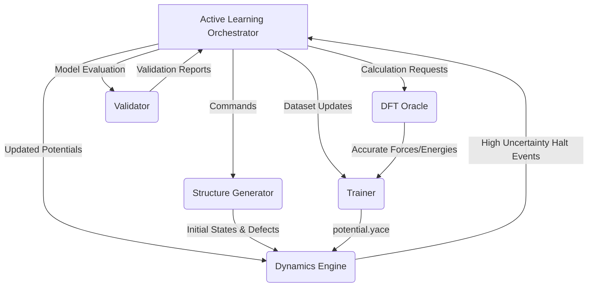

# System Architecture for MLIP-Pipelines

## 1. Summary

The mlip-pipelines project aims to democratise the construction and deployment of State-of-the-Art Machine Learning Interatomic Potentials (MLIP) by automating the process around the "Pacemaker (ACE: Atomic Cluster Expansion)" tool.
This system significantly reduces the required expertise in data science and computational physics, enabling researchers to automatically traverse from initial structure generation, Density Functional Theory (DFT) calculations, active learning, up to deploying the potential in production runs.

The automated workflow mitigates the high risks of physical failure in unseen regions and the accumulation of uninformative data. By combining an Adaptive Exploration Policy with stringent physical regularisation strategies (such as Delta Learning with a Lennard-Jones baseline), the system generates physically robust potentials with significantly higher data efficiency.

## 2. System Design Objectives

### Goal
The primary objective of this project is to develop a complete, zero-configuration active learning pipeline. By only requiring a single YAML configuration file, the system must autonomously carry out exploration of structural configurations, compute exact physical properties using a DFT Oracle, train a physically-informed MLIP, and validate it using a Dynamics Engine.

### Success Criteria
1.  **Zero-Config Workflow:** Automating the pipeline perfectly so users avoid writing manual Python scripts or managing loop iterations.
2.  **Data Efficiency:** Utilising Active Learning and strategic structure sampling to achieve equal precision (RMSE Energy < 1 meV/atom, Force < 0.05 eV/Å) with less than 1/10th of the DFT calculations needed in random sampling.
3.  **Physical Robustness:** Providing safety against collapsing models (due to unphysical overlapping forces) by forcing Delta Learning from a baseline (LJ/ZBL), thus preserving core-repulsion physics.
4.  **Scalability:** Assuring seamless deployment of the generated model from localised active learning to massive Molecular Dynamics (MD) or kinetic Monte Carlo (kMC) runs.

### Constraints
1.  **Domain Agnosticism:** The architecture must not be strictly tied to one chemical system or one molecular structure, adapting actively to user-defined domains.
2.  **Modularity:** The Python codebase must adhere strictly to modern modularity principles. Separation of concerns is paramount to prevent any "God Classes."
3.  **Hardware Adaptability:** The system modules should be containerisable and capable of migrating between local workstations and HPC clusters without breaking.

## 3. System Architecture

The core of the system is the Python-based **Active Learning Orchestrator**. This component directs the flow between four key independent modules. Strict boundaries and interfaces define how these elements interact to prevent tight coupling.
The interaction relies primarily on dependency injection and robust repository patterns to exchange data, structural geometries, and model checkpoints.

*   **Structure Generator (Explorer):** Responsible for finding unseen regions in chemical/structural space. It employs an Adaptive Exploration Policy determining exploration parameters dynamically (e.g. Temperature schedules, defect densities).
*   **Oracle (Teacher):** Wraps high-fidelity DFT simulations (e.g. Quantum ESPRESSO) to compute true forces/energies. Implements self-healing logic for SCF convergence and utilises smart periodic embedding to reduce redundant data.
*   **Trainer (Learner):** Controls the Pacemaker tool to fit the Atomic Cluster Expansion (ACE) potentials. Employs D-Optimality based Active Set optimisation.
*   **Dynamics Engine (Executor & Inference):** Employs the trained potentials in LAMMPS or kMC runs. Features critical On-The-Fly (OTF) uncertainty quantification tracking the `gamma` variable to halt on uncertain extrapolation regions.
*   **Validator:** Quality Assurance gate that scores the physical and mechanical stability (Phonon dispersion, Born criteria) before releasing the model.

### Component Diagram



### Boundary Management Rules
-   **No Circular Dependencies:** Components must interact strictly via the Orchestrator or well-defined Data Transfer Objects (Pydantic Models). The Trainer cannot directly call the Oracle.
-   **Stateless Implementations:** Computations within the Oracle and Structure Generator should remain stateless across cycles. State is preserved only within designated data repositories (e.g., `accumulated.pckl`).

## 4. Design Architecture

### File Structure Overview
The file hierarchy follows the standard `src/` layout ensuring distinct separation of concerns.

```ascii
project_root/
├── src/
│   ├── core/
│   │   ├── orchestrator.py      # Orchestrator core
│   │   ├── config_schemas.py    # Pydantic Core Models
│   │   └── exceptions.py        # Domain Exceptions
│   ├── generators/
│   │   ├── adaptive_policy.py   # Adaptive Policy Engine
│   │   └── defect_builder.py    # Atomic manipulators
│   ├── oracles/
│   │   ├── qe_manager.py        # Quantum Espresso Interface
│   │   └── embedder.py          # Periodic Embedding Logic
│   ├── trainers/
│   │   ├── pacemaker_wrapper.py # Trainer integration
│   │   └── active_set.py        # D-Optimality Filter
│   ├── dynamics/
│   │   ├── lammps_interface.py  # Hybrid Potential setup
│   │   └── eon_wrapper.py       # kMC integration
│   └── validators/
│       ├── stability_tests.py   # Phonon, Elasticity tests
│       └── reporter.py          # HTML Report generation
├── tests/
│   ├── core/
│   ├── oracles/
│   └── ...
├── pyproject.toml
└── README.md
```

### Core Domain Pydantic Models Structure
New Pydantic models will extend configuration definitions safely without breaking standard Python data handling.

*   `PipelineConfig`: Base schema representing the root `config.yaml`.
*   `ExplorationStrategy`: Defines variables like `R_MD_MC`, `T_schedule`.
*   `HaltEvent`: Captures exactly when and why the Dynamics engine failed (`gamma` threshold crossing, structure payload).
*   `ValidationScore`: Stores exact metrics returned by the Validator (RMSE, Phonon Stability boolean).

These schemas act as DTOs between the independent modules and the Orchestrator. The new schema objects naturally extend the system by standardising internal data passage.

## 5. Implementation Plan

The development is divided into exactly 8 implementation cycles.

1.  **Cycle 01: Core Framework and Pydantic Schemas**
    *   Setup the `src/` structure.
    *   Implement Pydantic models (`config_schemas.py`) to parse the initial user YAML configuration.
    *   Create base interfaces for all major modules (Explorer, Oracle, Trainer, Dynamics, Validator) to enforce dependency injection contracts.
2.  **Cycle 02: Adaptive Exploration Policy Engine**
    *   Develop the `Structure Generator` module.
    *   Implement the policy logic evaluating Material DNA and outputting the `ExplorationStrategy` (e.g. MD/MC Ratios, Defect densities).
    *   Include "Cold Start" screening functionality.
3.  **Cycle 03: The DFT Oracle and Periodic Embedding**
    *   Implement the `DFTManager` (`qe_manager.py`).
    *   Develop automated k-spacing, pseudo-potential lookups, and smearing adjustments.
    *   Code the `Periodic Embedding` logic extracting robust boundary conditions without vacuum gap noise.
4.  **Cycle 04: Trainer and Pacemaker Integration**
    *   Implement `PacemakerWrapper`.
    *   Code the `Delta Learning` baseline configurations (LJ/ZBL) for initial potential training.
    *   Integrate Active Set D-Optimality algorithms to restrict dataset expansion.
5.  **Cycle 05: Dynamics Engine and On-The-Fly (OTF) Handling**
    *   Implement the `MDInterface` mapping Python commands to LAMMPS.
    *   Incorporate hybrid overlay pairs (pace + zbl) directly into LAMMPS simulation runs.
    *   Code the "watchdog" catching the high `gamma` extrapolation points and triggering Halt Events.
6.  **Cycle 06: Active Learning Loop Closure (Orchestrator)**
    *   Construct the main `Orchestrator` to run cycles sequentially.
    *   Implement the OTF Halt-and-Diagnose sequence: generate local candidates -> select via D-optimality -> Embed -> Oracle.
7.  **Cycle 07: kMC Extension and Advanced Validation**
    *   Integrate `EONWrapper` to scale time simulations via kMC.
    *   Implement the `Validator` to evaluate mechanical stability, Phonon dispersion curves, and output formatted HTML reports.
8.  **Cycle 08: End-to-End Orchestration & User Documentation**
    *   Refine the full CLI experience and `main.py` entry point.
    *   Finalize UAT and Jupyter/Marimo tutorials ensuring seamless user journeys.
    *   Finalize error handling and CI/CD logging structures.

## 6. Test Strategy

Testing strictly relies on mocks and isolated temporary file structures to ensure no side-effects occur.

1.  **Cycle 01: Core Framework**
    *   *Unit Tests:* Assert Pydantic validation handles malformed YAMLs and properly propagates exception classes.
2.  **Cycle 02: Exploration Engine**
    *   *Unit Tests:* Ensure the policy decision matrix correctly maps input features to action parameters.
    *   *Mocks:* Mock structural descriptors to avoid invoking actual ML engines.
3.  **Cycle 03: DFT Oracle**
    *   *Integration Tests:* Use `tempfile.TemporaryDirectory` to test periodic embedding outputs.
    *   *Mocks:* Override `ase.calculators.espresso` execution calls to yield dummy energy dictionaries, avoiding actual parallel DFT runs.
4.  **Cycle 04: Trainer Integration**
    *   *Unit Tests:* Confirm the translation of data dictionaries to Pacemaker CLI arguments.
    *   *Mocks:* Use `subprocess.run` side_effects to mock successful training output without waiting for PyTorch/MACE processes.
5.  **Cycle 05: Dynamics Engine**
    *   *Unit Tests:* Ensure LAMMPS hybrid commands generate correctly formatted `in.lammps` strings.
    *   *Integration Tests:* Mock LAMMPS exceptions to test the orchestrator's capability to safely catch `HaltEvent`s.
6.  **Cycle 06: Loop Closure**
    *   *Integration Tests:* Use purely mock components for Explorer, Oracle, and Trainer to verify loop increments and valid dataset accumulation.
7.  **Cycle 07: KMC and Validation**
    *   *Unit Tests:* Test Phonon matrix manipulation assuming mock Hessian array matrices instead of `Phonopy`.
8.  **Cycle 08: Finalisation**
    *   *E2E Tests:* Create an artificial dummy configuration and assert the orchestrator finishes multiple cycles and correctly generates `potentials/generation_XXX.yace`.
