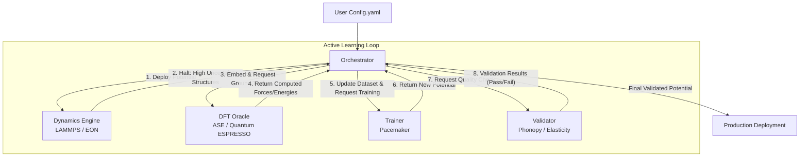

# System Architecture: MLIP Pipelines

## 1. Summary

The `mlip-pipelines` project is an advanced, automated, zero-configuration system meticulously designed to build, validate, and deploy Machine Learning Interatomic Potentials (MLIPs). It seamlessly integrates classical Molecular Dynamics (MD), adaptive Kinetic Monte Carlo (aKMC), Density Functional Theory (DFT), and modern Active Learning techniques. The system autonomously explores structural space, identifies atomic configurations with high uncertainty, automatically performs highly accurate quantum mechanical calculations on these specific regions, and iteratively refines a fast Atomic Cluster Expansion (ACE) potential. By orchestrating robust tools like LAMMPS, Quantum ESPRESSO, Pacemaker, and EON within a unified Python framework, the system drastically reduces the manual labour traditionally required to develop highly accurate, predictive, and physically grounded interatomic potentials for complex material systems. The pipeline operates under the strict principle of zero-configuration execution, meaning a single, high-level configuration file is sufficient to trigger the entire multi-stage generation process from exploration through deployment.

## 2. System Design Objectives

The design of the `mlip-pipelines` system is fundamentally driven by a series of critical objectives, strict constraints, and defined success criteria aimed at delivering an unparalleled user experience and robust scientific performance. The architecture must consistently deliver a reliable, highly accurate potential while entirely abstracting the underlying computational complexity from the end user.

**Primary Goal:**
To provide a true "zero-configuration" pipeline where a user can supply a minimal specification (e.g., target elements, basic thermodynamic conditions, and desired property metrics) and receive a fully trained, validated, and production-ready MLIP. The system must eliminate the need for manual dataset curation, repetitive DFT job submission, and iterative model tuning. This requires the pipeline to have built-in heuristics and adaptive intelligence to navigate common computational chemistry bottlenecks without user intervention.

**Constraint 1: Autonomy and Self-Healing**
The pipeline must operate entirely autonomously. It must incorporate profound self-healing mechanisms, particularly within the DFT Oracle and Dynamics Engine subsystems. If a Quantum ESPRESSO calculation fails to converge due to complex electronic structure issues, the Oracle must automatically adjust parameters such as mixing beta, smearing widths, or diagonalization algorithms to ensure successful completion. Similarly, if an MD simulation encounters catastrophic atomic overlap (e.g., leading to a segmentation fault in LAMMPS), the Dynamics Engine must predict the failure using extrapolation grades ($\gamma$), safely halt the simulation, extract the broken geometry, and trigger an active learning cycle.

**Constraint 2: Computational Efficiency and D-Optimality**
The system must be highly resource-efficient. It cannot afford to run full periodic DFT calculations on massive, thousands-of-atoms MD supercells merely because a small localized defect entered an extrapolation regime. Therefore, the system must implement a strict Periodic Embedding strategy. It must isolate the specific high-uncertainty atomic environments, construct minimal periodic boundary condition (PBC) preserving supercells encompassing the relevant cut-off and buffer regions, and restrict expensive DFT evaluations solely to these minimized domains. Furthermore, the Trainer must utilize strict D-Optimality criteria (via active set maximization) to select only the most informative configurations, minimizing the overall size of the training dataset while maximizing its descriptive statistical power.

**Constraint 3: Physical Correctness and Safety**
The generated potentials must strictly adhere to physical reality, even in regions completely devoid of training data. The system enforces a Delta Learning approach, utilizing a robust baseline potential (such as a Shifted Lennard-Jones or ZBL potential) to handle extreme short-range repulsive interactions. The ACE model is trained strictly on the residual difference between the DFT ground truth and this baseline. During inference, the hybrid potential guarantees that catastrophic atomic overlaps are physically prevented by the underlying repulsive core, ensuring long-term simulation stability.

**Constraint 4: Strict Separation of Concerns**
The architecture must avoid monolithic, tightly coupled designs ("God Classes"). It must employ modern software engineering principles, including Dependency Injection, the Repository Pattern, and distinct service layers. Each major functional component (Orchestrator, Dynamics, Oracle, Trainer, Validator) must operate independently, communicating through clearly defined Pydantic schemas acting as Data Transfer Objects (DTOs). This modularity ensures that individual components (e.g., swapping Quantum ESPRESSO for VASP) can be upgraded or replaced without triggering cascading failures throughout the pipeline.

**Success Criteria:**
1.  The system successfully completes an autonomous, multi-cycle active learning loop without any user intervention or manual debugging.
2.  The generated potential passes rigorous automated validation checks, including strict phonon stability (verifying the absolute absence of imaginary frequencies across the Brillouin zone) and mechanical stability (verifying strict Born criteria satisfaction for elasticity).
3.  The final potential achieves target accuracy metrics (e.g., Energy RMSE < 2 meV/atom, Force RMSE < 0.05 eV/Å) on a completely held-out test set.
4.  The system gracefully handles extreme extrapolation scenarios by halting, healing, and resuming MD trajectories without causing system crashes or catastrophic simulation failures.

## 3. System Architecture

The high-level architecture is organized around a central orchestrator that coordinates four specialized, highly decoupled subsystems. This architecture enforces strict modularity, ensuring that physical simulation execution is entirely isolated from quantum mechanical data generation and machine learning model training.

**Core Components:**

1.  **Orchestrator (`Orchestrator`)**: The central brain of the system. It manages the active learning state machine, tracking iterations, handling file routing via atomic operations to prevent corruption, and deciding when to transition between exploration, labeling, training, and validation phases. The Orchestrator does not perform physics calculations itself; it strictly acts as a high-level director passing structured instructions to specialized execution units.
2.  **Dynamics Engine (`DynamicsEngine`, `MDInterface`, `EONWrapper`)**: Responsible for structural exploration. It executes LAMMPS for Molecular Dynamics and EON for Adaptive Kinetic Monte Carlo. It constantly monitors the ACE potential's extrapolation grade ($\gamma$). Upon detecting an extrapolation event ($\gamma >$ threshold), it triggers a safe halt, extracts the problematic localized structural environments, and passes them back to the Orchestrator as standardized Python objects.
3.  **DFT Oracle (`DFTManager`)**: The ground truth generator. It accepts the localized, periodic embedded structures from the Orchestrator and performs robust, self-healing static DFT calculations (typically via ASE and Quantum ESPRESSO) to compute exact energies, forces, and stresses. The Oracle operates as an isolated black box, guaranteeing valid DFT outputs regardless of the input structure's initial stability.
4.  **Trainer (`ACETrainer`, `PacemakerWrapper`)**: The machine learning engine. It receives the new ground truth data, updates the accumulated dataset, and executes Pacemaker to perform D-Optimal active set selection and ACE potential fine-tuning. It ensures the Delta Learning protocol (ACE + Baseline) is strictly enforced and manages the serialization of the updated `.yace` potential files.
5.  **Validator (`Validator`)**: The quality assurance gatekeeper. It subjects the newly trained potential to a battery of physics-based tests, utilizing tools like Phonopy to verify dynamical stability and custom ASE scripts to evaluate elastic moduli and mechanical stability against Born criteria. It generates a comprehensive pass/fail report before allowing a potential to be deployed to production.

**Data Flow and Boundary Management:**

The system strictly enforces boundary management. The `Orchestrator` is the only component that dictates the high-level workflow. The `DynamicsEngine` does not communicate directly with the `Trainer`. Instead, the `DynamicsEngine` yields high-uncertainty configurations (as Pydantic DTOs or ASE Atoms objects) back to the `Orchestrator`. The `Orchestrator` then routes these to the `DFTOracle`. The `DFTOracle` returns computed ground-truth data, which the `Orchestrator` then passes to the `Trainer`. This strict separation ensures that each subsystem remains pure, highly testable, and independently scalable. If a new quantum chemistry backend needs to be introduced, only the Oracle component requires modification.



## 4. Design Architecture

The design architecture emphasizes modularity, schema-first development, and rigorous type safety. The file structure is logically partitioned to reflect the separation of concerns outlined in the system architecture. By standardizing communication through Pydantic data schemas, the system guarantees a robust contract between isolated computational components.

**Directory Structure:**

```text
project_root/
├── src/
│   ├── core/
│   │   ├── __init__.py
│   │   └── orchestrator.py        # Main state machine
│   ├── domain_models/
│   │   ├── __init__.py
│   │   ├── config.py              # Pydantic Config Definitions
│   │   └── dtos.py                # Data Transfer Objects
│   ├── dynamics/
│   │   ├── __init__.py
│   │   ├── dynamics_engine.py     # LAMMPS / EON integration
│   │   └── uncertainty.py         # Extrapolation grade monitoring
│   ├── generators/
│   │   ├── __init__.py
│   │   └── structure_generator.py # Defect / Interface creation
│   ├── oracles/
│   │   ├── __init__.py
│   │   ├── dft_manager.py         # ASE/QE Self-healing interface
│   │   └── embedding.py           # Periodic boundary cell carving
│   ├── trainers/
│   │   ├── __init__.py
│   │   ├── ace_trainer.py         # Pacemaker wrapper
│   │   └── baseline.py            # Lennard-Jones / ZBL logic
│   └── validators/
│       ├── __init__.py
│       ├── validator.py           # Orchestrates validation suite
│       └── phonopy_runner.py      # Phonon stability checks
├── tests/
│   ├── ... (test files mirroring src structure)
├── dev_documents/
│   └── USER_TEST_SCENARIO.md      # Acceptance criteria
├── pyproject.toml                 # Tooling configuration
└── README.md
```

**Core Domain Pydantic Models Structure:**

The system relies heavily on Pydantic `BaseModel` classes defined centrally in `src/domain_models/` to enforce strict validation. By applying `model_config = ConfigDict(extra='forbid')`, the system guarantees that any unrecognized configuration keys are rejected immediately at startup. This prevents confusing downstream errors that typically arise in complex scientific pipelines when a user misspells a configuration flag.

*   `SystemConfig`: The root configuration object, encompassing all sub-configurations and acting as the definitive source of truth for the Orchestrator.
*   `DynamicsConfig`: Defines MD/kMC parameters, temperature schedules, and strict thresholds for the extrapolation grade ($\gamma$) that trigger active learning loops.
*   `OracleConfig`: Specifies DFT parameters, K-point spacing targets, SSSP pseudopotential paths, and explicit self-healing retry limits and parameter scaling logic.
*   `TrainerConfig`: Controls Pacemaker settings, active set limits (D-Optimality), polynomial degrees, and baseline potential definitions.
*   `ValidationConfig`: Sets acceptable RMSE thresholds, required elastic moduli, and phonon stability criteria essential for production deployment.

**Extending Existing Domain Objects:**
New schema objects representing specific phenomena (e.g., an `InterfaceTarget` for the highly requested FePt/MgO scenario, or a `DefectConfiguration` for targeted spatial sampling) are implemented strictly as subclasses or compositional attributes of the base `SystemConfig`. The Orchestrator is designed to inspect these schemas dynamically. If an `InterfaceTarget` is present in the configuration payload, the Orchestrator automatically routes the initialization sequence through the `generators/structure_generator.py` to correctly construct the specified crystal interfaces before entering the standard active learning exploration loop. This additive, polymorphic schema design ensures the existing architecture remains completely intact while simultaneously supporting advanced new material use-cases without requiring complex conditional logic inside the core physics engines.

## 5. Implementation Plan

The project development is strictly decomposed into 6 sequential cycles. Each cycle delivers a fully testable increment of functionality, building systematically upon the previous cycle to ensure continuous integration and architectural stability.

### Cycle 01: Core Schemas and Orchestrator Foundation
*   **Focus:** Establish the foundational Pydantic schemas (`config.py`, `dtos.py`) and the base `Orchestrator` state machine framework. This phase requires defining the exact data contracts that will be passed between all isolated subsystems, guaranteeing type safety from the very beginning. The core Orchestrator loop will be designed to handle state transitions between "exploration," "oracle evaluation," "training," and "validation."
*   **Detailed Tasks:** Develop every nested configuration schema within the `SystemConfig` root model, ensuring strict validation. Construct the primary `Orchestrator` class, outfitting it with dummy methods for the physics engines to allow testing of the active learning state machine flow. Furthermore, implement bulletproof directory management; the Orchestrator must generate unique execution directories for every active learning iteration, utilizing temporary workspaces and atomic file moves to absolutely prevent data corruption during unexpected system crashes.
*   **Outcome:** A robust structural skeleton capable of parsing configurations, enforcing strict data typing, and executing a mocked active learning loop without dropping state or corrupting file paths.

### Cycle 02: Baseline Potentials and The Trainer Interface
*   **Focus:** Implement the Delta Learning foundation and the Pacemaker integration. Because ACE potentials must never be deployed without a repulsive baseline, this cycle prioritizes the physical safety constraints before attempting machine learning. Following the baseline setup, the Pacemaker training pipeline will be wrapped into a Python interface.
*   **Detailed Tasks:** Develop the `ShiftedLennardJones` and ZBL baseline classes, ensuring they can seamlessly integrate as ASE calculators. Implement the `ACETrainer` wrapper class, utilizing the subprocess module to safely invoke the `pace_train` and `pace_activeset` command-line utilities. Design the wrapper to capture standard output and standard error, converting Pacemaker logs into structured Python logging events. Crucially, ensure the trainer correctly outputs hybrid LAMMPS potential configuration files (`in.lammps`) that combine the learned `.yace` model with the repulsive baseline.
*   **Outcome:** The system gains the absolute capability to train an ACE potential given a pre-existing dataset of ASE Atoms objects, producing a fully deployable hybrid potential file.

### Cycle 03: Dynamics Engine and Uncertainty Monitoring
*   **Focus:** Integrate LAMMPS as the primary exploration engine and implement the On-The-Fly (OTF) failure detection watchdog. This cycle represents the heart of the adaptive exploration logic, enabling the system to explore phase space autonomously without requiring human supervision to prevent crashes.
*   **Detailed Tasks:** Develop the `DynamicsEngine` using the ASE LAMMPS calculator (or direct Python LAMMPS bindings if required for efficiency). Implement the watchdog logic to constantly monitor the `pace_gamma` extrapolation grade. Implement the `fix halt` capture mechanism; when LAMMPS raises a halt signal, the Python engine must catch it gracefully, preventing a hard crash. Subsequently, implement the `extract_high_gamma_structures` method, which parses the LAMMPS dump files at the exact moment of the halt to extract the specific atomic geometries that violated the uncertainty threshold.
*   **Outcome:** A deeply robust MD engine that safely and cleanly halts when entering dangerous extrapolation regions, returning the specific problematic atomic geometries back to the Orchestrator for further analysis.

### Cycle 04: The Self-Healing DFT Oracle and Periodic Embedding
*   **Focus:** Implement the quantum mechanical ground truth generator, prioritizing autonomous self-correction. Because DFT calculations frequently fail due to electronic convergence issues, this Oracle must be intelligent enough to adjust its own parameters without user intervention. Furthermore, the embedding logic must be built to limit calculation costs.
*   **Detailed Tasks:** Develop the `DFTManager` utilizing ASE's Quantum ESPRESSO interface. Implement the complex self-healing retry logic: if an SCF calculation fails, the Oracle must catch the error, adjust parameters like `mixing_beta` or smearing widths, and restart the calculation. More importantly, implement the `Periodic Embedding` mathematical logic. This logic must take an isolated defect structure, carve an orthorhombic cell around it encompassing the ACE cut-off radii, apply proper periodic boundary conditions, and prepare it for a minimized DFT calculation, drastically reducing the required K-point mesh and plane-wave grid relative to computing the entire MD supercell.
*   **Outcome:** The profound ability to autonomously generate highly accurate quantum mechanical forces and energies for localized defect structures, gracefully recovering from standard DFT convergence failures without requiring any human intervention.

### Cycle 05: Quality Assurance Validator
*   **Focus:** Implement the rigorous physics-based validation suite. A machine learning potential cannot be trusted merely based on its RMSE training loss; it must reproduce macroscopic physical observables. This validation gatekeeper is the final hurdle before a potential is marked as production-ready.
*   **Detailed Tasks:** Develop the `Validator` class. Integrate the `phonopy` library to compute accurate phonon dispersions and critically check for the presence of imaginary frequencies, which indicate dynamic instability. Implement automated strain-energy calculations, applying minimal geometric distortions to compute the elastic constant tensor. Compare these computed moduli against expected Born stability criteria for the specific crystal lattice. The Validator must generate a comprehensive pass/fail report based strictly on these physical metrics.
*   **Outcome:** An automated, unforgiving gatekeeper that ensures only physically sound, dynamically stable potentials are ever marked as production-ready, protecting end-users from deploying flawed MLIPs.

### Cycle 06: Integration, Advanced Generation, and User Acceptance
*   **Focus:** Tie all previously built components together, implement specialized structure generators for complex edge cases, and finalize the interactive tutorials required to prove system efficacy to the user. This final phase focuses heavily on the user experience and ensuring the "zero-config" promise is fully realized.
*   **Detailed Tasks:** Integrate the Orchestrator with the fully functional Dynamics, Oracle, Trainer, and Validator subsystems. Implement the `StructureGenerator` to handle complex cases like the FePt/MgO interface requested in the primary User Acceptance Test (UAT). Finally, develop the unified Marimo tutorial (`tutorials/UAT_AND_TUTORIAL.py`). This tutorial must support both a rapid `Mock Mode` for CI validation and demo purposes, and a `Real Mode` for executing genuine quantum mechanical pipelines.
*   **Outcome:** The complete, fully functional `mlip-pipelines` system, flawlessly demonstrated via an engaging, interactive, zero-configuration User Acceptance Test that generates a complex interfacial potential from scratch.

## 6. Test Strategy

Testing is paramount for a system orchestrating complex, long-running physics simulations. A single uncaught error deep within an active learning loop could waste thousands of CPU hours. Therefore, we employ a rigorous, multi-layered testing strategy that ensures absolute reliability without requiring massive computational resources for every standard Continuous Integration (CI) run.

### Cycle 01 Testing (Schemas & Orchestrator):
*   **Unit Tests:** Validate all Pydantic schemas using standard `pytest`. We must write explicit test cases to ensure the strict `extra='forbid'` constraints throw the appropriate `ValidationError` when supplied with arbitrary or mistyped dictionary keys. We will test the Orchestrator's internal state machine transitions using pure Python mock objects to ensure logic flows correctly without invoking any external dependencies.
*   **Side-Effect Mitigation:** All Orchestrator file operations must strictly use `tempfile.TemporaryDirectory` and atomic file moving strategies (like `os.replace`). Pytest suites must verify that running an orchestrator cycle leaves absolutely zero residual files in the local repository workspace, preventing test state pollution.

### Cycle 02 Testing (Trainer & Baseline):
*   **Unit Tests:** Verify the mathematical correctness of the `ShiftedLennardJones` calculator on extremely small, manually verified atomic configurations, asserting that forces and energies match expected classical calculations perfectly.
*   **Integration Tests:** Execute the `ACETrainer` class using a minimal, pre-computed dataset containing only a handful of structures. Verify that the subprocess calls to `pace_train` and `pace_activeset` execute correctly, parse standard output without failing, and produce a valid `.yace` output file.
*   **Side-Effect Mitigation:** Utilize strictly isolated temporary directories for all Pacemaker file I/O operations. The test fixture must automatically purge the generated potential files and pacmaker log artifacts upon test completion, ensuring a completely clean environment for subsequent test runs.

### Cycle 03 Testing (Dynamics & Uncertainty):
*   **Integration Tests:** Run a heavily constrained LAMMPS simulation on a tiny supercell using a dummy potential. Intentionally force an unphysical atomic overlap (e.g., by artificially placing two atoms extremely close together) to reliably trigger the high-$\gamma$ extrapolation halt. Verify that the `DynamicsEngine` catches the LAMMPS halt signal cleanly, does not crash the overarching Python process, and correctly extracts the precise localized atomic geometry responsible for the uncertainty.
*   **Side-Effect Mitigation:** Restrict all MD runs in the test suite to extremely small step counts (e.g., `< 100` steps) and strictly utilize temporary run directories. This ensures the tests run in milliseconds rather than hours while still exercising the critical On-The-Fly extraction logic.

### Cycle 04 Testing (Oracle & Embedding):
*   **Unit Tests:** Rigorously test the complex `Periodic Embedding` geometric mathematics. Ensure that given a localized defect structure, the generated orthorhombic cell completely and accurately encapsulates the designated cut-off radii, while correctly maintaining periodic boundary conditions without inadvertently overlapping atoms across the boundary.
*   **Integration Tests:** Test the `DFTManager`'s self-healing retry logic by intentionally providing a difficult-to-converge electronic structure configuration and utilizing an ASE mock calculator that is programmed to throw an SCF failure on the first attempt. Verify that the Oracle automatically adjusts the `mixing_beta` parameter and retries the calculation successfully. (This logic will be primarily mocked in standard CI to avoid dependency overhead, but run in full on dedicated high-performance runners).
*   **Side-Effect Mitigation:** Heavily utilize the `unittest.mock` library to patch the actual Quantum ESPRESSO executable calls in standard CI runs. This allows the system to thoroughly test the Python control flow and error recovery loops without requiring a heavy, local Quantum ESPRESSO installation on the CI server.

### Cycle 05 Testing (Validator):
*   **Integration Tests:** Provide the `Validator` class with two explicit potentials: a known "good" baseline potential and a purposefully crippled "bad" potential designed to be dynamically unstable. Verify that the Phonopy integration correctly identifies the imaginary frequencies in the bad potential and rejects it, while simultaneously passing the good potential. Ensure the generated validation report accurately reflects these distinct states.
*   **Side-Effect Mitigation:** Use extremely small supercells (e.g., $2 \times 2 \times 2$) for all validation tests to drastically minimize the computational overhead required to calculate the phonon force constants, allowing the test to run quickly in a standard CI environment.

### Cycle 06 Testing (E2E Integration & UAT):
*   **End-to-End Tests:** Execute the full, multi-stage Orchestrator loop (Exploration $\rightarrow$ Halt $\rightarrow$ Extract $\rightarrow$ Label $\rightarrow$ Train $\rightarrow$ Validate) using the configured `Mock Mode`. This proves the entire state machine works cohesively from end to end without requiring hours of actual compute time.
*   **Tutorial Validation:** The automated CI pipeline will execute the final Marimo notebook (`tutorials/UAT_AND_TUTORIAL.py`) in headless execution mode (`subprocess.run([sys.executable, "-m", "marimo", "run", ...])`). This critical validation step ensures that the user-facing documentation is completely executable, mathematically sound within the mock environment, and entirely free of underlying Python syntax errors or logic bugs, guaranteeing a flawless "Aha! Moment" for the end user.